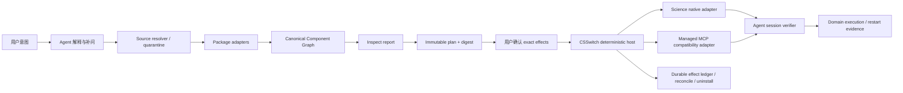

# Science Skill / MCP / Plugin 扩展控制面

状态：已接受目标设计；inspect-only source adapter 已存在但尚无产品 caller；plan / apply、artifact 与 runtime 验证均为 `NOT-RUN`

适用范围：CSSwitch 对 Agent Skills、OpenAI Plugin、Claude Plugin 与 local / remote MCP 输入的识别、规划、受控安装、Science 投影、验证、更新和卸载目标架构。

最后复核：2026-08-13

失效条件：Agent Skills、OpenAI Plugin、Claude Plugin 或 MCP 的上游合同发生不兼容变化；Science 建立新的公开稳定扩展 API；CSSwitch 明确改变扩展控制面的 ownership、安全边界或兼容策略；或本文任一未实现部分开始实现、完成实现或推进证据层时，对应状态与段落立即失效，并须在同一候选中重新评审。

本文冻结尚未实现的目标合同，不描述当前产品已经具备这些能力。源码当前另有一个仅接收
调用方已取得 archive bytes、无 Gateway / Tauri / Agent caller 的 inspect-only adapter；
它只产生 quarantine inspection report，不构成 plan、apply、安装或 runtime 能力。
当前已实现的 GitHub / 本地包窄桥、状态码和用户行为只以
[外部 Skill 安装桥](../features/external-skill-bridge.md)为准；逐能力当前 ownership / non-target / 证据层只以
[产品与 Claude Science 能力地图](../features/product-science-capability-map.md)为准；
probe 与真实结果分别留在
[Science 探针合同](../operations/science-probe-spec.md)和日期化 evidence。

## 1. 冻结结论

1. 不存在一个可以让 CSSwitch “实现一次、完整兼容所有平台”的统一 Agent Plugin
   协议。Agent Skills 与 MCP 是两个开放公共原语；OpenAI Plugin 与 Claude Plugin
   是各自宿主的产品级包、安装与生命周期合同。
2. CSSwitch 对所有声明支持的输入先做**无执行 inspection**，再归一化成组件图；
   “能识别包”不等于“能安装全部组件”。兼容性按组件判定，不按整个包给一个模糊
   的成功标签。
3. Agent 负责理解意图、解释方案、补问、取得确认和会话级验证；CSSwitch
   deterministic host 负责所有持久化、进程、配置、凭证引用、Science
   attach/detach、回读、补偿和 receipt。Agent 可以编排注册，但不直接拥有注册副作用。
4. Science 继续拥有 Agent/session、Skill discovery/load/trigger、原生 MCP client、
   Agent binding 与领域执行语义。CSSwitch 只投影自己明确管理的组件，不建立第二套
   Science 数据库、catalog、entitlement 或自由写配置的 Agent 通道。
5. 初始共同执行面是 Agent Skills 与明确版本的 MCP profile。`agents/`、hooks、UI、
   LSP、monitors、settings 等供应商组件只有在 Science 能力被独立证明且语义可以保持时
   才能晋级；否则必须显式降级或拒绝，禁止静默丢弃后仍报告“完整 Plugin 已安装”。
6. 当前 v1 bridge 继续原样生效。本合同不注册新 command，不改变 route，不执行安装。
   旧 Skill Manager 的删除是独立 negative refactor，不实现本合同，也不建立 artifact、
   installed 或 live `PASS`。

## 2. 外部协议事实与 Science 未验证边界

本节使用四类标签，避免把外部规范、CSSwitch 决策和当前实现混在一起：

- `EXTERNAL-OFFICIAL`：上游当前公开规范或产品合同；
- `CSSWITCH-DESIGN`：本文冻结的目标设计；
- `SOURCE-CONTRACT`：仓库当前已实现合同，须沿现有功能文档和源码验证；
- `NOT-VERIFIED`：没有绑定 exact Science runtime / artifact 的充分证据。

### 2.1 Agent Skills

`EXTERNAL-OFFICIAL`：Agent Skills 是以 `SKILL.md` 为必需入口的开放目录格式，
可含 `scripts/`、`references/`、`assets/`；格式规定 `name`、`description` 等
frontmatter、progressive disclosure 与实验性的 `allowed-tools`。`allowed-tools` 表示
Skill 声明的预批准工具，但不同 Agent 实现的支持可以不同；规范不把它提升为跨宿主
可移植、可强制执行的完整权限或 sandbox 合同，也不规定下载源、安装目录、marketplace、
Agent binding、更新或卸载。见
[Agent Skills specification](https://agentskills.io/specification)。

`CSSWITCH-DESIGN`：Agent Skills 只作为 Skill 组件的静态输入基线。格式有效只证明
“可进入规划”，不证明 Science 已发现、attach、load、trigger 或成功执行。adapter 必须把
`allowed-tools` 原样保留为 `declared_preapproved_tools`，不能把它改写成 Skill 必须使用的
`required_permissions`；实际权限需求只能由已检查的脚本、引用、tool call 与 executable
effect 独立得出。CSSwitch 不把上游“pre-approved”声明自动变成 Science / host 授权；无法
保真承接预批准语义时，只把该 permission declaration 标为 `DEGRADED` / `UNSUPPORTED` 并
说明原因，不能仅据此判定整个 Skill 不可用。任何实际 effect 仍分别设置
`confirmation_required` 和原因。

### 2.2 OpenAI Plugin

`EXTERNAL-OFFICIAL`：OpenAI Plugin 是 ChatGPT / Codex 的可安装包，可以组合 Skills、
MCP server 与可选 UI；公共 listing 可由 ChatGPT 与 Codex 的受支持 surface 发现，
但组件仍可只在特定 surface 生效。每个包以 `.codex-plugin/plugin.json` 为必需入口，
可在包根携带 `skills/`、`.mcp.json`、`.app.json`、hooks 与 assets。见
[Plugin architecture](https://developers.openai.com/plugins/concepts/plugins)、
[Package your plugin](https://developers.openai.com/plugins/build/plugins)和
[supported surfaces](https://learn.chatgpt.com/docs/plugins)。

`CSSWITCH-DESIGN`：OpenAI manifest 是一个输入 adapter，不是 Science 原生格式声明。
`skills` 进入 Skill 组件；`mcpServers` / `apps` 进入 MCP 组件；hooks、UI 与展示信息
分别进入自己的组件类型。CSSwitch 不把 OpenAI 的 universal directory 误称为跨供应商
通用协议，也不承诺 `agents/openai.yaml`、hooks 或 UI 在 Science 中等价运行。

### 2.3 Claude Plugin

`EXTERNAL-OFFICIAL`：Claude Plugin 是 Claude 产品级自包含组件包。Claude Code
当前可发现 `skills/`、root `SKILL.md`、受支持的 flat Markdown `commands/*.md`、
`agents/`、hooks、`.mcp.json`、LSP、workflows、output styles、themes、channels、monitors、
dependencies 与 `bin/` 等；新 Plugin 推荐使用 `skills/` 而不是 flat `commands/`。
`.claude-plugin/plugin.json` 当前可选，存在时只有 `name` 必填。`.mcp.json`、
`${CLAUDE_PLUGIN_ROOT}`、安装 scope、cache 与自动进程生命周期属于 Claude 产品合同，
不属于 MCP wire protocol。见
[Claude Code Plugins reference](https://code.claude.com/docs/en/plugins-reference)。

`CSSWITCH-DESIGN`：Claude Plugin 容器可以被检查并定位独立 Skill / MCP 组件，但
Claude-specific `agents/`、`commands/`、hooks、LSP、workflows、output styles、themes、
channels、monitors、dependencies、executables、settings、变量与 lifecycle 不会因包被识别
而自动映射到 Science。`commands/*.md` 不按 shell command 执行，也不在没有独立转换
合同的情况下伪装成 Agent Skill。

### 2.4 MCP

`EXTERNAL-OFFICIAL`：MCP 是 host/client/server 之间交换 context、tools 与能力的开放
协议；当前正式 revision 为 `2026-07-28`。该 revision 使用 stateless、self-contained
request 和 per-request capability negotiation；标准 transport 是 stdio 与每个消息一次
POST、响应为 JSON 或 request-scoped SSE 的 Streamable HTTP。更早 revision 的
`initialize`、connection-scoped session、GET stream 与 server-initiated JSON-RPC
request 属于 legacy era，必须独立协商。见
[MCP 2026-07-28](https://modelcontextprotocol.io/specification/2026-07-28)和
[transport contract](https://modelcontextprotocol.io/specification/2026-07-28/basic/transports)。

MCP core 不定义下载、解压、配置落盘、进程安装、更新或卸载。Registry 只提供
discovery / package / remote metadata；本地一键安装的命令透明与用户同意属于客户端
安全责任，而不是 wire-level install RPC。见
[MCP Registry](https://modelcontextprotocol.io/registry/about)和
[SEP-1024](https://modelcontextprotocol.io/seps/1024-mcp-client-security-requirements-for-local-server-)。

HTTP authorization 是 optional；启用时按 HTTP OAuth 合同处理，stdio 不套用该流程，
凭证来自受控环境或宿主机制。见
[MCP Authorization](https://modelcontextprotocol.io/specification/2026-07-28/basic/authorization)。

`NOT-VERIFIED`：Science 当前实际协商的 MCP revision、2026 stateless/MRTR 语义、
legacy fallback、HTTP headers、OAuth discovery/registration/token lifecycle 与 extension
支持均未由公开产品材料或当前 exact-runtime 证据建立。

### 2.5 Claude Science

`EXTERNAL-OFFICIAL`：Anthropic 当前公开材料证明 Science 具有 Skills、connectors 与
specialist-agent 产品概念。见
[Claude Science announcement](https://www.anthropic.com/news/claude-science-ai-workbench)。

`NOT-VERIFIED`：这不证明 Science 读取 `.claude-plugin/plugin.json`、
`.codex-plugin/plugin.json`、Claude Code `agents/` / hooks / `.mcp.json`，也不证明它完整
实现 Agent Skills 规范或某个 MCP revision。Science 的 attach/readback、目录、刷新时机、
进程、OAuth 与 restart 行为都必须绑定 exact runtime 分项取证。

## 3. 目标控制面



目标链路固定为：

1. **Resolve**：解析 exact Git/archive/marketplace/registry identity，冻结版本与 digest；
   不执行包内容，不读取真实账号凭证。
2. **Inspect**：各平台 adapter 只解析声明和文件，形成 canonical component graph；
   所有可执行内容仍处于 quarantine。
3. **Plan**：Agent 结合用户目标和 Science capability report 生成不可变 plan；host
   复核 schema、source identity、目标 org/runtime 与 effect allowlist，并生成 digest。
4. **Confirm**：用户看到安装来源、每个组件状态、精确文件/config/process effect、
   local MCP 完整 executable/argv/env-name、权限、凭证来源、降级项与 rollback 边界后确认。
5. **Apply**：只有 CSSwitch host 消费已确认 digest，持有 durable operation lease，按
   effect 原子提交或留下可恢复 receipt；Agent 不能自由改写 plan。
6. **Project to Science**：按 exact Science runtime capability 选择原生投影或受管 MCP
   compatibility adapter，再执行 attach/config/readback。
7. **Verify**：Agent 在当前 session 验证 Skill load / tool discovery / tool call；领域执行
   与 restart persistence 继续作为独立证据。
8. **Reconcile / uninstall**：同一 ledger 和 ownership marker 决定 detach、config/process
   cleanup、quarantine、补偿与 restart 后恢复，不按聊天文本猜状态。

## 4. Canonical Component Graph

每个输入包先归一化为下面的概念模型；这不是已实现的序列化 schema：

```text
PackageIdentity
  ecosystem              agent-skill | openai-plugin | claude-plugin | mcp
  source                 exact immutable locator
  resolved_version       tag/revision/package version
  content_digest         full inspected payload digest
  publisher/license      declared identity, never treated as trust proof

Components[]
  kind                    skill | mcp_server | agent | hook | ui | lsp |
                          workflow | output_style | theme | channel | monitor |
                          dependency | executable | asset | setting | permission |
                          unknown_host_component
  source_path
  declared_dependencies
  executable_effects
  required_secrets        names/references only
  target_surface
  allowed_protocol_profiles  exact revision + transport pairs for mcp_server
  compatibility_status
  degradation_reason
  confirmation_required
  confirmation_reasons
```

组件兼容状态只有以下四种：

| 状态 | 含义 |
|---|---|
| `NATIVE` | exact Science runtime 已证明可保持该组件语义，允许走原生 adapter |
| `ADAPTED` | CSSwitch 有确定性转换或 compatibility adapter，并有独立语义验收 |
| `DEGRADED` | 只能保留明确子集；必须列出丢失语义并由用户单独确认 |
| `UNSUPPORTED` | 当前不能安全或保真执行；不产生副作用 |

是否需要确认是与兼容状态正交的字段，不是第五种兼容状态。任何组件都可设置
`confirmation_required: true`，并分别列出本地进程、外部认证、权限、数据披露、
破坏性 effect 或 degradation 等 `confirmation_reasons`。例如一个 `NATIVE` local MCP
仍必须确认 executable / argv，一个 `DEGRADED` Skill 还必须另行确认丢失的组件语义。

“兼容”只允许表示：包能被 inspection，且每个组件都有上述明确结果。初始政策是：

- Agent Skill：进入 Skill 组件；Science format/binding 未证明时仍不是 `NATIVE`；
- OpenAI / Claude Plugin 的 Skill 成员：可进入 Skill 适配计划；
- `.mcp.json`、OpenAI registered MCP mapping、Registry/raw MCP：进入 MCP 计划，不能
  因配置文件可解析就自动启动；
- agents、hooks、UI、LSP、workflows、output styles、themes、channels、monitors、
  dependencies、executables、settings：默认 `UNSUPPORTED`，直至建立明确的 Science
  owner、权限、生命周期和 evidence；
- adapter 必须同时 inventory manifest 声明、默认自动发现目录、未被 manifest 引用但
  目标宿主会加载的路径，以及 package 内全部剩余 entry。任何当前或未来供应商 surface
  无法无歧义归类时创建 `unknown_host_component`，标为 `UNSUPPORTED` 并阻断 apply；
  未知 entry 不得降为普通 asset 后随受支持子集一起复制；
- `bin/`、scripts、dependency 与其他 executable payload 即使没有立即执行，也必须作为
  独立组件绑定调用者、解释器/包管理器、权限和 lifecycle；没有受支持 caller 时不复制到
  Science 可自动发现或受管包根；
- package 含 unsupported 组件时，可以只生成 inspection report；只有用户明确确认
  `DEGRADED` plan 且未安装 payload 不可能在之后被自动执行，才允许安装受支持子集；
- 任何 partial import 都不得返回“完整 Plugin installed”。

### 4.1 不可信输入与文件系统不变量

所有 source、archive、marketplace package、registry package 和本地包都按不可信
payload 处理。某类 source 只有在 adapter 为它冻结并测试了下面的不变量后，才能从
inspect-only 晋级到 apply：

1. **根目录与路径**：解析和物化始终锚定新建的 mode `0700` operation staging root，
   使用目录 fd / rooted relative operation；拒绝绝对路径、空或 `.` / `..` segment、NUL、
   平台分隔符歧义、超长路径、过深目录，以及 escaping link。不能先字符串检查再通过
   可变路径重新打开。
2. **文件类型与碰撞**：默认只接受普通文件和目录；拒绝 symlink、hardlink、device、
   FIFO、socket 与其他特殊 entry。拒绝重复路径、文件/父目录冲突、Unicode NFC、
   case-fold 与目标文件系统会合并的名称碰撞。adapter 不得用“最后一个 wins”。当前最小
   source-only adapter 不声称已实现完整跨平台 Unicode identity；它保留非 ASCII 资源并
   返回 `Partial` / `Unsupported`，不得把这项目标不变量写成已满足。owner、
   setuid/setgid/sticky、ACL、xattr、resource fork 与其他未建模 metadata 不得继承到目标；
   允许的 mode/metadata 必须规范化、进入 digest，并在 inspection report 中明确。
3. **资源限额**：每个 source profile 必须有版本化、数值化并由 fixture 锁定的 raw
   download/archive bytes、entry count、single-file bytes、expanded total bytes、path bytes、
   depth、compression ratio、redirect/dependency depth 与 wall-clock limit；未知 size、流式
   expansion 或 nested container 也必须在消费过程中计数并 fail closed。当前 v1 的精确
   数值仍只由[外部 Skill 安装桥](../features/external-skill-bridge.md#package-安全边界)维护；
   新 adapter 未冻结自己的数值前不得进入 apply。
4. **无执行 inspection**：inspection 不运行 script、hook、binary、package lifecycle、
   post-install、interpreter discovery 或 dependency installer；executable bit 只作为被检查
   的 metadata。manifest、license、publisher、tool annotation 和 signature 声明都不是信任
   证明。
5. **字节身份**：resolver 从同一个已打开 object / fixed remote identity 取得内容；规范化
   tree digest 至少绑定 normalized relative path、entry type、executable bit、length 与 exact
   bytes。`PackageIdentity.content_digest`、component graph、plan digest 与用户确认都绑定该
   tree digest，而不是仅绑定 URL、tag、mtime 或 manifest version。
   每个 remote source profile 还必须冻结允许的 scheme/origin、redirect、TLS、credential
   reference、immutable version resolution 与 dependency source；跨 origin、mutable ref 漂移、
   authentication challenge 或未声明 dependency 使本次 inspection 失效。
6. **确认后防 TOCTOU**：apply 不再从原 mutable URL/path 或用户文件重新取内容，只消费
   CSSwitch-owned content-addressed staging snapshot；在持有目标 operation/data-dir/org lease
   后，重新校验 staging root identity、每个 entry 与完整 tree digest。任一 byte、path、type、
   mode、source identity 或 plan drift 都使确认失效并返回新 inspection，不自动接受变化。
7. **目标 namespace**：从已固定的可信隔离根开始，在 operation lease 内打开并固定 exact
   target data-dir 与每一级 ancestor directory fd，记录 canonical path、`dev/inode`、owner 与
   mount identity；逐级
   no-follow 遍历，拒绝 symlink、非目录或 replacement。conflict/owner check、temporary root
   创建、目标 readback 与最终 rename 都必须相对同一组已固定 dir fd 执行，不得检查后再从
   字符串绝对路径重开。commit 前后都从可信根 no-follow 重新解析公开路径并与 pinned
   `dev/inode` 链比较；任一 ancestor/target identity、unexpected link/type、owner 或 mount 漂移
   都 fail closed，返回 `UNCERTAIN` / 新 inspection；不得沿 replacement 继续写入或清理。
8. **目标提交**：绝不覆盖不受 CSSwitch 管理的目录；文件从已验证 snapshot 物化到目标
   parent 同文件系统、同 pinned dir-fd namespace 下的私有 temporary root，完成权限、内容与
   持久化检查后执行 fd-relative atomic no-clobber publication，并从同一 pinned fd 回读最终
   tree identity。新路径必须使用 kernel no-replace primitive；更新 exact owned target 时先按
   expected identity 把旧目标原子移入 owned quarantine，再 no-replace 发布新目标。平台无法提供
   所需原语时该 adapter 为 `UNSUPPORTED`，不能降级为 check-then-overwrite。
   跨文件提交必须有 journal、明确 commit point 与 crash recovery；失败不得留下可被 Science
   自动发现的半包。ancestor swap、target symlink/replacement、hardlink/link-count drift、并发
   conflict 与每个 commit crash window 都必须有 deterministic fixture。
9. **清理**：quarantine、staging、download 与 journal 都带 operation owner、deadline 和
   cleanup receipt；清理只能删除 exact owned identity。uncertain cleanup 保留可诊断记录，
   不扩大路径或递归猜测 owner。

如果 package dependency 指向根外、动态下载、安装脚本或未冻结的 nested package，adapter
只能报告 `UNSUPPORTED` / 独立待确认组件，不能在 apply 过程中临时取得或执行它。

## 5. Agent、CSSwitch 与 Science 的责任

| Owner | 必须负责 | 不得负责 |
|---|---|---|
| Agent | 理解目标；补问 source/target；解释 component plan；取得确认；原样调用受限 host capability；轮询同一 operation；验证 session load/tool/domain | 自行下载、解压、复制、覆盖；自由写 Science config/DB；持有 secret；猜来源；自动确认；在 uncertain 后重放 mutation |
| CSSwitch host | source/digest；静态校验；plan digest；lock/lease；filesystem/config/process effect；secret reference；Science attach/detach/readback；receipt、补偿、reconcile | 替 Science 判断 Skill trigger/domain success；模拟 catalog/OAuth/entitlement；静默转换未知组件 |
| Science | 原生 Agent/binding/session；Skill discovery/load/trigger；原生 MCP client；权限 UI；领域工作流 | 接管 CSSwitch package ownership、host rollback 或外部 package 信任判断 |
| 外部 MCP/service | tool schema；认证授权；服务端输入校验；实际数据和动作 | 借 Plugin/Skill 安装绕过用户授权或宿主 policy |

Agent **可以完成编排**，但不是 durable mutation owner。如果某个 Science 版本只提供
Agent-side API，CSSwitch host 先冻结 exact plan/digest 和一次性 capability；Agent 只允许
提交这一个受限 effect，host 随后做 readback 并记录 receipt。不能退化为“Agent 自己想办法
调用任意 Science 工具”。

## 6. Operation、effect 与故障合同

每次 apply 使用一个不可复用 `operation_id`，并绑定：

- schema version、intent、exact subject 与 request digest；
- CSSwitch / Science runtime identity、active org 与 target agent；
- package identity 与 component plan digest；
- 用户确认的 exact effects、权限和 degradation；
- 每个 effect 的 authority、verifier、subject identity 与 evidence reference / digest；
- allowed reentry、automatic retry policy 与 terminal outcome。

effect 至少分为：

1. source resolved；
2. content fetched / opened；
3. inspection completed；
4. plan confirmed；
5. package committed / quarantined；
6. Science registered / attached / detached；
7. session loaded；
8. tool called / domain executed；
9. restart persisted；
10. config/process/owned-path cleanup。

每个 effect 只能是 `NOT_STARTED`、`COMMITTED`、`VERIFIED`、`UNCERTAIN`、`FAILED`
或 `COMPENSATED`。前一层成功不能补绿后一层；`UNCERTAIN` 必须先 readback，不能自动
重放。`COMMITTED` / `VERIFIED` 只能由该 effect 的明确 authority 发布：source、package、
config、process 与 owned-path 由 CSSwitch host receipt 证明；Science register / attach / detach
必须绑定 exact runtime 与 native readback；session load、tool call 与 domain execution 必须绑定
目标 Agent/session、tool/server identity 和对应 verifier evidence。Agent 的自然语言观察只能作为
带来源的 session evidence，不能直接晋升为 host-authoritative `VERIFIED`，也不能补写相邻
effect。最终响应由 durable ledger 投影，mailbox status 只作进度提示。

Gateway mailbox 与本地 picker 最终必须共享同一跨进程 operation coordinator、目标
data-dir/org lease、ledger 和恢复规则。当前单 Skill “host quarantine 后由 Agent 调
detach” 的不对称流程要迁回 deterministic host，与 bundle 共用 detach/readback/补偿；
route Skill、connector、managed prompt 和 marker 的非原子步骤分别产出 typed receipt，
不能把部分完成报告成“完全未修改”。

## 7. MCP profile、认证与 Science 路由

每个 MCP server 的 inspection / plan 必须绑定 `allowed_protocol_profiles`；每一项都是
exact `protocol_revision` + `transport_binding`，不能只写“支持 MCP”“支持 Streamable HTTP”
或一个笼统的“2025 legacy”标签。只有一个允许结果时列表长度为一；允许 fallback 时，
用户确认页逐项展示每个 exact profile 及其不同的 session/message/header/auth/cancellation
语义。下表只是可识别的候选 profile catalog，不是当前支持列表或全部实施承诺；只有进入
具体组件 plan、已有对应 adapter / fixture、并完成用户确认的条目才能进入
`allowed_protocol_profiles`。旧 revision 默认关闭，必须由明确产品需求与 exact-runtime probe
逐项晋级。未列 profile fail closed：

| `protocol_revision` | `transport_binding` | 目标政策 |
|---|---|---|
| `2026-07-28` | `stdio` | 新 local 基线候选；adapter 与证据建立前仍不启用；exact executable + argv，无 shell expansion；受控 env 与进程 owner |
| `2026-07-28` | `streamable_http` | 新 remote 基线候选；adapter 与证据建立前仍不启用；per-request semantics、required metadata/header、request-scoped SSE |
| `2025-11-25` | `streamable_http_legacy` | 默认关闭；有明确需求时才建立 exact-revision adapter 与测试，不混用 2026 per-request 假设 |
| `2025-06-18` | `streamable_http_legacy` | 默认关闭；有明确需求时才按该 revision 固定 header/message/session 语义并独立测试 |
| `2025-03-26` | `streamable_http_legacy` | 默认关闭；有明确需求时才按该 revision 固定 batch/message/session 语义并独立测试 |
| `2024-11-05` | `http_sse_legacy` | 默认关闭的 deprecated candidate；晋级时必须显式展示风险、测试独立 adapter 并冻结退场条件 |

inspection 不启动或连接 server，因此它只能记录 manifest/registry 声明、adapter capability
和用户允许的 exact profile，不能声称已经协商。用户确认 local executable / argv / env / 权限
或 remote origin / auth 后，Apply 才能启动或连接 server。实际结果只写入 effect receipt 的
`negotiated_protocol_revision`、`negotiated_transport_binding` 与 capability digest，并满足：

- 结果必须精确属于已确认的 `allowed_protocol_profiles`；否则终止连接/进程并 fail closed；
- 不在已确认集合内做自动 legacy fallback，不把新结果追加到既有 plan；
- profile 验证完成前不做 tool call、不传用户/resource data，也不把 server annotation 当权限；
- profile 合法只允许继续走对应 permission/auth/tool-discovery effect，不等于这些 effect 已验证；
- plan、confirmation、receipt、restart reconciliation 与 evidence 分别保存 allowed set 和
  negotiated result，二者不能用一个字段覆盖。

目标路由顺序：

1. `SCIENCE_NATIVE`：只有 exact Science runtime 已证明目标 revision、transport、feature、
   auth 与 restart lifecycle 时使用；
2. `CSSWITCH_MANAGED_ADAPTER`：Science 原生能力未知或不兼容、但 CSSwitch 能以稳定本地
   connector 保持所需语义时使用；adapter 只在已确认 profile allowlist 内负责
   modern/legacy negotiation、进程、auth、
   permission、audit 与 cleanup；
3. `UNSUPPORTED`：resources/prompts/tools、MRTR、extensions、auth 或 cancellation 无法保真
   时停止，不以“至少 tools 能用”静默降级。

HTTP OAuth 与 stdio credential 必须分开：

- plan、日志和 receipt 只保存 secret reference / issuer / scope metadata，不保存 token；
- CSSwitch 不读取或导入真实 Science / Claude account credential；
- HTTP auth 使用官方用户可见流程，验证 resource/audience/issuer、PKCE、scope step-up、
  refresh/revocation；registration mode 不能只假设 DCR；
- stdio 只从明确 allowlist 投影所需 env，完整 env name/value effect 在确认与 redaction
  合同中分别处理；
- local server 执行前显示 exact executable、全部 argv、工作目录、env names、网络/文件
  权限、publisher/source/digest，并取得肯定确认；不运行 package lifecycle script。

## 8. 演进与验收不变量

本文不维护一次性的实施队列、阶段编号或证据晋升顺序；具体批次由当前任务系统管理，
所有实际结果只沿[生产链路验收](../operations/real-machine-acceptance.md#2-唯一证据链)
的唯一证据链判定。本控制面在任何实施批次中都必须保持：

- 未注册、未编译的旧 Skill Manager 已由独立 negative refactor 删除；它不得重新成为
  parser、component graph、operation ledger 或 Science adapter 的依赖，该删除也不构成
  本合同的任何 inspect / plan / apply 实现；
- inspection 始终无执行；parser、component graph、limits 与 fixture 的存在不打开 apply path；
- 新的 plan/effect/next-action 表达不得改变当前 v1 public tool schema 或结果，除非该兼容
  边界已经单独冻结、实现并验收；
- mailbox 与 local picker 的 mutation 最终共享 deterministic host ownership、ledger、
  detach/readback/recovery 和 typed receipt，Agent 自然语言永远不成为 mutation authority；
- Science native 或 managed MCP route 只能在 exact runtime capability 与对应 adapter 语义
  分项建立后启用，不预设 Science 支持，也不自动 legacy fallback；
- 每次 source、artifact、isolated-live、authorized-live、installed、signing 或 release 状态变化
  都按唯一验收链独立记录，不得由本架构正文或相邻层结果代为晋升。

## 9. 接受标准与非声明

未来实现只有同时满足以下条件，才能把某组件从设计提升为当前能力：

- input identity、component graph 与 degradation 可由机器稳定回读；
- exact effect 经过用户确认，Agent 无法扩大；
- package/config/process/Science mutation 具有 owner、receipt、readback、rollback/reconcile；
- current runtime 的 native/adapter 语义由 positive、negative、race、restart 与 uninstall
  fixture 覆盖；
- attach、session load、tool call、domain execution 与 restart persistence 分项记录；
- 新 source、artifact、isolated-live 和需要授权的 live evidence 各自绑定 exact identity；
- unsupported vendor component 不被静默遗漏或错误命名为完整兼容。

截至本次复核，inspect-only parser、component graph、limits 与 fixtures 已进入 source；
它们没有产品 caller，不打开 plan / apply。artifact、installed、Skill/MCP runtime 与真实服务
证据仍为 `NOT-RUN`；source 验证状态只由 exact-SHA gate 记录判定。本文的通过只代表设计
边界及该 source-only 范围已复核。
