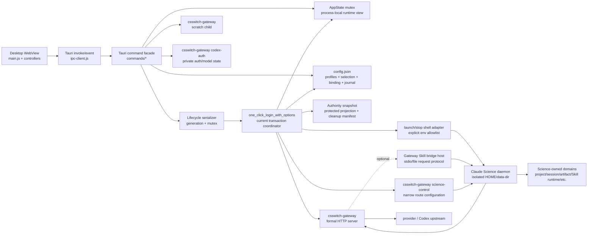
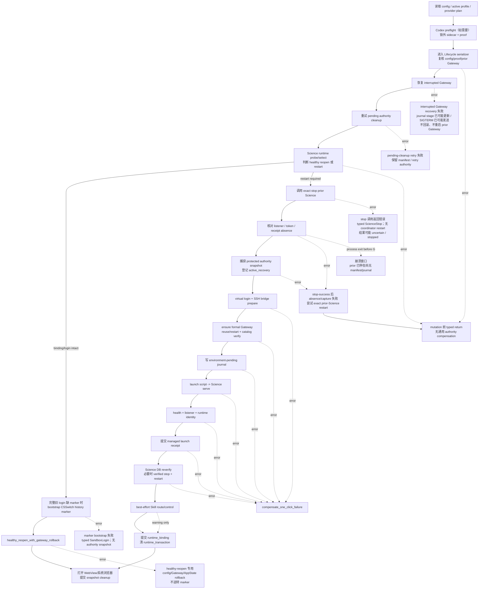
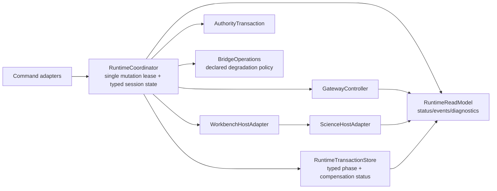
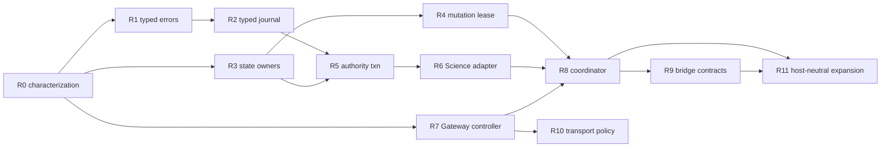

# CSSwitch `next` × Claude Science 运行架构再基线

审计日期：2026-07-31（Asia/Taipei）

状态：已完成作者自检与 clean-context 独立审查；最终结论 PASS

适用范围：本地 `next` worktree `/private/tmp/csswitch-next-20260730`，
exact HEAD `468fcf77ea13ac4f894c4595eb87f4dbfe7e72cd`。

证据边界：本文还原当前源码、注册面、测试合同和文档合同；不代表 final artifact、
installed/live、真实 provider、真实 Claude Science、账号、SSH、签名、公证或公开
release PASS。本文没有读取真实 `~/.claude-science`、API key、OAuth token、
Keychain、SSH 私钥或账号数据库。

失效条件：`next` 在上述 SHA 后出现产品源码、测试、quality contract、状态 owner、
Claude Science 适配合同或产品范围的实质变化时，受影响结论必须重新调查。目标候选
和迁移切片在被正式接受并提炼进 architecture/feature/operation 前只属于本次建议，
不是当前产品合同。

## 1. 结论

机械职责拆分已经把大文件按维护原因放回了清晰目录，但没有消除真正的运行耦合。
当前系统的主风险不再是“文件太大”，而是一个跨多个事实权威的长事务仍由
`runtime/sandbox_session/one_click.rs::one_click_login_with_options` 集中协调：

- `Config` 与持久 runtime journal/binding；
- `AppState` 中的 Gateway、Science、boot、history 和 cleanup 镜像；
- Gateway child、path secret、launch context 与 catalog identity；
- Science executable、listener、data-dir 与 managed launch receipt；
- protected authority snapshot 与 pending-cleanup manifest；
- virtual login、SSH stub/sidecar、Skill route/connector；
- Codex auth proof 与补偿时重新启动 prior Gateway 的能力。

这不是简单的模块调用密集，而是**事务正确性依赖多个状态 owner、时序和补偿条件同时
成立**。机械拆分后的首要逻辑重构应当是建立 typed runtime coordinator / transaction
model，而不是继续按行数拆文件，也不是先扩张 Skill/MCP/Plugin 产品面。

同时，`restore_history_choice_command` 是一条独立的生产 mutation：它可先停止
managed Science，再改写历史身份，成功后才由 frontend 发起新的 one-click。它没有
runtime journal、authority snapshot 或 command-level compensation，是主事务之外
必须先冻结的真实边界，不能在迁移时被一键流程的恢复能力“代偿性覆盖”。

主一键事务自身也有一个 snapshot 之前的 durable gap：prior Science stop 调用可能
在已有进程副作用后报错，且 verified stop 到 manifest/journal 建立之间没有持久恢复
记录。目标 coordinator 需要显式解决它，但调研阶段不改变现有行为。

更早的 interrupted Gateway recovery 也不是只读 preflight：它会更新既有 journal
stage，并可能向精确确认的 orphan Gateway 发送 SIGTERM；`StopFailed` 后不会回滚
journal 或重启 prior Gateway。这是另一条必须独立冻结的 snapshot 前副作用边界。

healthy reopen 也并非 authority-read-only：它可能先为完整的 v0.8.0 virtual login
补写 CSSwitch-owned history marker，再进入只覆盖 config/Gateway/AppState 的 dedicated
rollback；后续 reopen 失败不会删除该 marker。这个 durable upgrade 需要显式 receipt/
policy，而不是被“无 authority snapshot”这句话隐藏。

此外，runtime mutation 不只发生在 one-click：mode/settings、stop/quit、Codex
auth/network/feature/downgrade，以及 profile key/delete 都有生产 frontend
caller。多条路径会先停 runtime 再提交 config/sidecar/export，失败后没有 prior restart
或 journal；profile key/delete 则是先提交 config 再停 tracked Gateway。目标
coordinator 必须覆盖这组 control-plane operation，不能只重写一键。

无 bundled caller 也不等于无运行影响：注册态 `start_proxy` 是 Gateway-only live
mutation，`apply_profile_preset_sync` 是 desired-intent mutation。两者必须在 R0
决定移除注册面还是纳入 operation plan。前者还可能在 Gateway spawn 前持久化 path
secret、轮换 Skill bridge key，并在使用健康 Science 的派生 host context 启动后只把
显式参数写入 launch recipe；后续 prior-Gateway restore 因而可能拿到缺失 Science
context 的配方。这不是“只启动一个 child”的无状态旁路。

退出本身还有两条不同生产路径：frontend `quit_app_command` 可因 Science stop 失败而
拒绝 exit；原生菜单/Cmd-Q 触发 `RunEvent` 的 `cleanup_for_exit`，会先清理 Codex
children，忽略 Science stop 错误并继续停 Gateway/退出，且不 bump generation。目标
不能用一个抽象 `Quit` 抹平这组差异。锁定的 Tauri 2.11.5 会依次触发
`ExitRequested` 与 `Exit`，当前 match 对两者都调用 cleanup，因此 terminal cleanup
还具有两轮重试/重复副作用语义。

推荐目标是候选 B：保留单进程 Desktop 与 Rust Gateway sidecar，把当前一键流程逐步
收敛为“host-neutral runtime coordinator + Science host adapter + typed durable
transaction + bounded bridge operations”。不建议当前直接上独立 daemon/event store；
那会提前引入新的安装、升级、IPC、守护进程和故障恢复负担。

## 2. 调研范围与方法

### 2.1 当前权威链

本轮按以下顺序判断：

1. exact `next` source tree；
2. 当前 source/unit contract 与本轮实际运行结果；
3. 当前 architecture/feature/operation 文档；
4. 日期化 audit/context。

现有架构文档只作为问题入口和待核对主张，不反向覆盖源码。`next` 的最终身份通过
实时 worktree/commit graph 核对：`468fcf7` 包含 merge `5dbee3e`，其第二 parent
是累积机械拆分候选 `78be80c`；当前三个拆分 worktree 均为 `next` 的祖先或已合入
分支。

### 2.2 追踪的生产纵向链

- WebView bootstrap、controller、Tauri invoke/event；
- profile 创建/编辑/选择、mode/settings 与 Codex control plane；
- auto-boot、手动一键、healthy reopen、history recovery、stop/quit；
- formal/scratch Gateway、provider/Codex inference、model catalog、SSE；
- Science executable selection、launch、health、receipt、reuse、stop；
- authority snapshot、runtime journal、pending cleanup 与补偿；
- local/GitHub Skill 窄 bridge、Science control route、doctor reconcile；
- SSH opt-in preflight/stub/wrapper；
- status/operation trace 与失败投影。

以下不进入当前产品实现范围：重建 Science project/session/artifact/permission/
environment/kernel/Agent/Plugin 语义、通用 MCP 管理器、官方 entitlement 模拟、
Science 下载器或远程访问服务。

### 2.3 证据词表

| 标记 | 本文含义 |
|---|---|
| `SOURCE-CONTRACT` | exact HEAD 中存在的生产代码、注册面、状态和协议事实 |
| `SOURCE-TEST-EXISTS` | exact HEAD 中存在相应测试；不自动表示本轮已运行 |
| `RUN-EVIDENCE` | 本轮实际执行并记录退出码/run seal 的 source/unit 结果 |
| `DOC-CONSISTENT` | 当前权威文档与源码抽查一致 |
| `JUDGMENT` | 从源码事实推导的架构判断或候选设计 |
| `UNKNOWN/NOT-RUN` | 当前证据不能升级的 artifact/runtime/provider/Science 事实 |

## 3. 当前运行架构

### 3.1 进程与控制拓扑



关键边界：

- `desktop/src-tauri/src/lib.rs::run` 是注册和 process composition root；
- frontend 由 `main.js` 注入 `runtime-controller.js`、`profile-controller.js`、
  `codex-controller.js`，不是单一 controller；
- `commands/runtime.rs`、`runtime/science.rs`、`runtime/proxy_lifecycle.rs` 和
  `runtime/sandbox_session/mod.rs` 是 façade，不是新的状态 owner；
- Gateway 默认 HTTP server、`codex-auth`、`skill-install-mcp` 与
  `science-control` 共享一个 binary，但拥有不同的运行和状态合同；
- Science launcher 是短命脚本；实际 detached daemon 不由
  `AppState.sandbox: Child` 持久拥有，控制依赖 runtime identity、receipt 和 live
  listener 的组合。

### 3.2 Desktop 启动与入口

`lib.rs::run` 创建三类 process-local authority：

1. `SharedAppState = Arc<Mutex<AppState>>`；
2. `SharedLifecycle = Arc<Lifecycle>`；
3. `SharedCodexAuthSupervisor = Arc<CodexAuthSupervisor>`。

`setup` 会加载/迁移配置、把窗口关闭改为隐藏，并调用
`run_boot_coordinator`。single-instance plugin 的第二实例回调也会调用同一
coordinator：`BootState::Idle|Failed` 可重新进入 boot 决策，
`Starting|Ready` 则只显示主窗口。auto-boot 只有环境变量
`CSSWITCH_AUTO_BOOT_ON_LAUNCH=1` 才启用：

```text
official mode -> open_official
proxy + eligible active profile -> one_click_login_cmd
otherwise -> show panel
```

手动一键和 auto-boot 最终共享 `one_click_login_cmd` 与同一失败 DTO。frontend
同时监听 `boot://failed` / `boot://attention`，并通过 `boot_error` /
`boot_attention` 补读 listener 建立前的结果。关闭窗口不会停止链路；显式 quit 或
Tauri exit 才进入受管清理。

两种 exit 不等价：frontend `quit_app_command` 先走可失败的 `stop_all_inner_cmd`，
成功才 `app.exit`；原生菜单/Cmd-Q 进入 `cleanup_for_exit`，先清 Codex children，
best-effort stop Science 后无论结果都 stop Gateway 并继续退出。`Cargo.lock` 固定
Tauri 2.11.5；其 `AppHandle::exit` 合同触发 `ExitRequested` 和 `Exit`，当前 run
callback 对两个 event 都调用 `cleanup_for_exit`。所以 command quit 成功后也会再走
两轮 native cleanup；native quit 第一轮 stop error 后，第二轮可能再次尝试同一
Science runtime 和 Codex cleanup。

### 3.3 选择与应用分离

`commands/profiles.rs::set_active_profile` 只提交 `Config.active_id`，不会立即切换
Gateway/Science。连接编辑先构造 candidate、执行 isolated scratch validation，再
持久化 profile；它同样不应用运行态。bundled frontend 的完整 apply boundary 只有
下一次一键开始；但注册态 `start_proxy` 是无 bundled caller 的 Gateway-only bypass，
可按 selected profile 替换 live Gateway，却不提交 `runtime_binding`、不停止 Science。
它不等于完整 apply，但必须作为独立 mutation 而不是 dormant noise。

因此当前至少存在三种 profile 事实：

| 事实 | 位置 | 含义 |
|---|---|---|
| selected | `Config.active_id` | UI 当前选择，可能尚未应用 |
| desired | `runtime/provider.rs::desired_runtime_binding` 的即时派生值 | 由 selected profile/provider plan、ports、path secret、SSH bridge fingerprint 和本次选定 Science identity 计算；没有独立持久 owner |
| applied | `Config.runtime_binding` + live identities | 最近一次完整健康提交；持久 commit 仍须与当前 Gateway/Science identity 合读 |

UI status 会同时读取 active profile 和当前 tracked Gateway identity；两者可能暂时不
一致，这是设计允许的 pending 状态，不应被诊断为自动切换失败。

### 3.4 一键启动主事务



需要特别保留的分支差异：

- healthy reopen 不建立 authority snapshot，也不重启 Science；它有自己的 config /
  Gateway/AppState snapshot 和补偿；但在进入该 helper 前可能补写 CSSwitch-owned
  history marker，后续 rollback 不逆转 marker；
- cold start 在 route reconcile 后提交 runtime binding；
- healthy reopen 先提交 binding/清 journal，再 best-effort route reconcile；
- history-choice attention 会保留 backend opaque candidates、清 journal，并让
  snapshot 转入可清理成功路径；
- open surface 失败不会回滚已健康 runtime，只返回 fallback URL。

这里有七个不同失败/副作用漏斗，不能合并：

1. command config/proof/prior-Gateway snapshot 复核和 runtime selection 等
   mutation 前错误直接 typed return；
2. interrupted Gateway recovery 在精确身份复核后会把既有 journal stage 更新为
   `recover_interrupted_gateway`，再可能向 orphan Gateway 发 SIGTERM；`StopFailed`
   直接 typed return，不回滚 journal、不重启 prior Gateway，进程可能仍活或稍后退出；
3. pending authority cleanup 依赖持久 manifest/CAS；失败时保留 retry authority，
   不进入新 transaction compensation；
4. healthy reopen 可能先幂等补写 CSSwitch history marker；marker bootstrap 失败
   直接 typed return，而 bootstrap 成功后的 Gateway/config failure 只回滚
   config/Gateway/AppState，保留 marker；
5. exact Science stop 调用本身若返回错误，coordinator 直接返回 typed
   `ScienceStop`，不会
   重启 prior Science；底层 stop 此时可能已调用 Science stop、发送 TERM/KILL 或处理
   receipt，结果可能是 uncertain 或实际上已停；
6. 只有 stop 返回成功但 absence proof 失败，或随后 snapshot capture 失败，才尝试
   exact prior-Science restart；
7. 只有 snapshot 已成功、进入 `transaction_result` 后的失败才进入
   `compensate_one_click_failure`。healthy reopen 另有自己的 Gateway/config rollback。

另有一个持久恢复空窗：prior Science 已 verified stopped 后，到
`OneClickAuthoritySnapshot::capture` 注册 active-recovery manifest 之前，既没有
manifest，也尚未写 `runtime_transaction`（journal 在 snapshot 成功后才开始）。此间
进程退出可留下 Science stopped，且没有持久 recovery record。

### 3.5 显式 history-choice 恢复事务

一键流程检测到多份遗留历史时，只生成 process-local opaque references 并返回
attention。用户选择后走另一条已注册生产 command，而不是继续原一键 transaction：

```text
runtime-controller.js::restoreHistoryChoice
  -> invoke restore_history_choice
  -> restore_history_choice_command 取得 Lifecycle
  -> 复核 mode / open journal / active profile / sandbox port / opaque reference
  -> exact managed stop，或拒绝未知 listener
  -> 再次复核 config
  -> oauth_forge::restore_history_choice
       revalidate candidate inode -> rewrite active-org/login -> write CSSwitch marker
  -> 轮换全部 process-local references
  -> command 成功后 frontend 另行调用 runOneClick
```

这条 command 当前**不建立** runtime journal 或 authority snapshot，也没有
command-level compensation。exact stop 之后若 config recheck 或 credential rewrite
失败，不会在该 command 内重启 prior Science；credential/marker 已写后也没有 inverse
receipt。只有 command 完整成功，frontend 才启动一个新的 one-click 请求。现有直接
测试冻结了 candidate inode revalidation，但没有冻结 command 级
stop/config-race/reference-rotation/restart 链。

因此 history attention、显式 history restore、随后 one-click 是三个相邻但不同的
事务边界；迁移时不能把它们当作一个已有统一 journal/compensation 的流程。

### 3.6 非一键 runtime mutation 家族

下列入口都生产可达：大部分由 `lib.rs::run` 注册且有 frontend caller，原生 exit
则来自菜单/Cmd-Q 与 Tauri `RunEvent`。它们取得 `Lifecycle` 或 Codex mutation lease，
但没有共同 transaction plan：

| Operation / frontend caller | 当前顺序 | 失败与补偿边界 |
|---|---|---|
| 切 official：`set_mode_inner` / `profile-controller.js::switchMode` | verified stop Science -> stop Gateway -> `config.mode=official` | stop 失败则不继续；config commit 失败时 runtime 已停，无 journal/snapshot/prior restart |
| ports/SSH：`set_settings_inner` / `persistRuntimeSettings` | 必要时 stop Science -> bump -> stop Gateway；disable SSH 时 revoke bridge/stub -> config commit | revoke/stub/config 失败可留下 runtime stopped、bridge 部分撤销、旧 config 保留；无 compensation |
| frontend stop / command quit：`stop_all_inner_cmd`、`quit_app_command` / runtime controller | bump -> 尝试 stop Science -> 无论结果都 stop Gateway；command quit 只在 stop command 成功后 `app.exit` | Science stop error 时 Gateway 已停；stop 返回 partial error，command quit 不退出 |
| 原生菜单/Cmd-Q：`cleanup_for_exit` / Tauri `RunEvent::ExitRequested|Exit` | 每个 event 都执行：cancel/wait Codex children -> TERM/KILL remaining -> Lifecycle 内尝试 stop tracked Science -> 忽略错误 -> stop Gateway；Tauri 2.11.5 的 exit 会触发两个 event | 不 bump generation、无失败 DTO、无 prior restart；第一轮 stop error 后第二轮可再尝试，Codex bounded cleanup 也可重复 |
| Codex login/logout：`prepare_codex_auth_mutation` / `startCodexLogin`、`doLogoutCodex` | 只对精确 Codex runtime：stop Science -> bump -> stop Gateway；随后 spawn/login 或 logout sidecar | sidecar spawn/operation/terminal failure 不重启 runtime，无 journal/snapshot |
| Codex disable/network：`set_experimental_codex_enabled`、`set_codex_network` / `toggleCodexFeature`、`saveCodexNetwork` | disable 或受影响 Codex chain 先 teardown，再 config commit；enable 可只写 config，其他 provider 可 preserve | post-stop config failure 留下 stopped runtime；无 compensation |
| Codex downgrade：`stop_all_before_downgrade` / `doCodexDowngrade` | picker/preview revalidate -> stop Science/Gateway -> export + v2 commit/latch -> exit | safe precommit failure 仍可能发生在 runtime 已停之后；terminal post-publish failure 强制退出；无 runtime restart |
| profile key/delete：`clear_profile_key_cmd`、`delete_profile_cmd` / profile controller | 先提交 config；若 target 是 applied，清 applied binding、bump 并 stop tracked Gateway；若 target 是 selected，清 key 会改 desired intent，delete 会清 `active_id`；两种角色可重合 | selected-only 不停当前 runtime；applied 分支不停止 Science、无 rollback，Science 可暂时失去 Gateway；非 selected/non-applied 是普通 profile mutation |
| selected profile：`set_active_profile_inner_cmd` / `profile-controller.js::activate` | 校验无 open transaction 与 profile/plan 结构，只提交 `Config.active_id` | 不 teardown/apply，保留 applied/runtime；是 intent mutation，不是 runtime no-op |
| connection intent：`update_profile_connection_inner_cmd` / `profile-controller.js::connSave` | 锁外 Codex proof（如需）-> Lifecycle 内复核 proof/open transaction -> 构造候选 -> isolated scratch tri-state -> 条件提交 | 200=`validated=true` 提交；405/429/5xx/无响应=`validated=false` 仍 best-effort 提交；明确 auth/model reject 才不提交；applied/runtime 保持不变 |
| registered Gateway-only start：`start_proxy_inner_cmd` / 无 bundled frontend caller | 锁外 provider auth proof -> Lifecycle 内按 `Config.active_id` 调 `ensure_proxy`；secret 为空时先提交新 secret；可从健康 remembered Science 派生 Skill host context；restart 时先写/轮换 bridge key 再 spawn | 可停/替换 tracked Gateway、保留运行中 Science；不写 journal/runtime binding。selected != applied 时会立即改变 live inference route；launch recipe 只保存显式 `science_runtime` 参数，派生 context 可能未被保存 |
| registered preset intent sync：`apply_profile_preset_sync` / 无 bundled frontend caller | Lifecycle 内复核 open transaction + preview fingerprint -> 更新 catalog/default/roles | applied/live 保持不变，只改变下一次 desired intent；target=selected=applied 时可把 `selection_pending` 从 false 变 true，selected-only 也改变当前 pending，applied-only/other 不改变当前 selected-derived desired |
| UI one-shot config consumption：`get_config` / `build_get_config` | 先从一次 config snapshot 取出 `pending_notice`，再用独立 `config::update` 清空 | 无 `Lifecycle`；返回与清空的组合不是原子 read-and-clear，新 notice 可在两步之间被清掉；只消费迁移/UI notice，不改变 runtime intent/binding，故不纳入 RuntimeCoordinator |

这些路径说明 `Lifecycle` 目前只提供互斥，不提供原子性或补偿。它们与一键、history
restore、interrupted recovery 共同构成 runtime mutation inventory；目标设计若只迁移
`one_click_login_with_options`，仍会保留多套 stop/commit 语义。

### 3.7 Gateway 请求面

正式 Gateway 只绑定 `127.0.0.1:<proxy_port>`。`GET`/`POST` 先通过 URL path
secret，再处理 `/health`、`/v1/models` 和 `/v1/messages`。formal 与 scratch
共享 provider contract 和 binary，但 scratch 使用临时 port/secret/intent/child
guard，不写 `AppState` 或 runtime binding。

Gateway 内部有四个不同状态面：

| 状态面 | Authority |
|---|---|
| immutable launch config | process env -> `GatewayConfig` |
| relay live-model observation | process-local `RelayModelCache` |
| Codex auth/model catalog | private files + generation/lock + process-local catalog |
| Skill install host | bridge directory/token/request IDs + host lock |

每个 accepted HTTP connection 创建线程。raw `CONNECT` 在 path-secret 解析前由
`server.rs::handle_one` 分派，只受 Anthropic/Claude hostname denylist；DNS 没有
独立 deadline，连接建立后没有 idle/session/byte/concurrency limit。它是当前
source contract 的本机 TCP tunnel，不等于 MCP/connector 产品支持。

### 3.8 Science host adapter 的当前形态

Science 适配逻辑分布在三层：

1. Rust `runtime/science/*`：executable 选择、fingerprint、listener/data-dir
   identity、managed receipt、probe/stop；
2. Rust `runtime/sandbox_session/*`：protected projection、一键事务、journal、
   cleanup、route/SSH prepare；
3. shell `launch-virtual-sandbox.sh` / `stop-science-sandbox.sh`：最终 HOME/data-dir/
   port/opaque-root/SSH guard 与 `claude-science serve|stop` 调用。

生产 launch/stop 使用 `runtime/launch_env.rs` 的 `env_clear`/allowlist；launch
脚本再用 `/usr/bin/env -i` 启动 Science，并显式注入：

- isolated `HOME`；
- `ANTHROPIC_BASE_URL=http://127.0.0.1:<gateway>/<secret>`；
- `HTTPS_PROXY` fast-fail/tunnel endpoint 与 loopback `NO_PROXY`；
- selected Science binary、data-dir、UI/preview port；
- `--no-auto-update`；
- 可选 SSH wrapper/context。

Science project/session/artifact/permission/environment/kernel/Agent/Skill execution 等仍由
Science 拥有。CSSwitch 只拥有启动包络、协议适配、保护投影、身份验证和窄 bridge。

## 4. 状态权威与一致性模型

| 状态 | 当前唯一或组合权威 | 写入者 | 主要消费者 | 崩溃/重启语义 |
|---|---|---|---|---|
| profiles、active selection、ports、mode、SSH/Codex settings、path secret | `config.json` | config/profile/runtime commands | Desktop、Gateway/Science plans | 原子文件提交；不是跨进程锁 |
| selected profile | `Config.active_id` | profile/config commands | UI、下一次 runtime plan | 持久 selection，不表示已 apply |
| profile connection intent | selected/non-selected `Profile` 的 endpoint、credential、catalog、roles | `update_profile_connection` | `desired_runtime_binding`、下一次 one-click | scratch true/false 都可提交，explicit reject 不提交；不改 applied commit 或 live runtime |
| preset catalog intent | Profile catalog/default/roles | registered `apply_profile_preset_sync` | `desired_runtime_binding`、`selection_pending`、下一次 one-click | preview fingerprint 后提交；无 bundled caller，不改 applied/live；target 是 selected 时改变当前 desired/pending，applied-only/other 不改变 selected-derived desired |
| desired binding | 无独立持久 owner；`desired_runtime_binding` 即时派生 | one-click/reopen planner | restart/reuse decision | 输入含 selected profile/provider plan、ports、path secret、SSH fingerprint、选定 Science identity |
| applied binding | `Config.runtime_binding` + verified live identities | successful one-click/reopen | restart/reuse decision、UI | commit 只代表最近健康提交，必须与 live identity 合读 |
| in-flight runtime transaction | `Config.runtime_transaction` | one-click checkpoints | Gateway recovery、Science recovery | 自由字符串 stage；部分阶段 fail-closed；当前在 snapshot 成功后才开始，不能覆盖 prior-stop 空窗 |
| Gateway child ownership | `AppState.proxy` | proxy lifecycle | stop/status/compensation | app 重启后不自动 adopt；只在严格 journal/identity 下停止 orphan |
| Gateway launch recipe | `AppState.gateway_launch_context` | proxy publish | rollback/restart prior Gateway | 含 credential，只在内存；app 崩溃后丢失；`start_proxy` 可用 remembered Science 派生 host context 启动，但 recipe 的 `science_runtime` 仍为 `None`，故不是所有路径的完整配方 |
| registered Gateway-only bypass | `AppState` tracked Gateway、可能新 `Config.secret` 与 `runtime/skill-install-bridge.key`；无对应 binding commit | `start_proxy` | test IPC/潜在 invoke caller、live Science | 可按 selected 替换 Gateway且保留 Science，selected/applied bookkeeping 不随之提交；spawn/health 失败也不回滚 secret/key |
| Science selected/runtime identity | `AppState.science_runtime` + executable fingerprint | selection/launch/recovery | reuse/stop/Skill context | 可从 receipt/listener/snapshot 恢复，不单信端口 |
| Science stopped fast token | `AppState.science_confirmed_stopped` | verified stop | next runtime selection | 单进程 one-shot，app 重启丢失 |
| Science daemon ownership | receipt + canonical executable + data-dir + unique listener PID/start | managed launch/runtime state | stop/recovery | 任一不一致即拒绝发送信号 |
| boot/history references | `AppState` | boot coordinator/history recovery | frontend one-shot flows | app 重启失效；敏感路径不跨 IPC |
| explicit history selection | Science credential/active-org files + CSSwitch marker；候选 reference 只在 `AppState` | `restore_history_choice_command` / oauth forge | 随后的独立 one-click | command 无 journal/snapshot/补偿 receipt；成功后轮换 reference |
| protected rollback | private snapshot + pending-cleanup manifest | authority transaction | compensation/recovery | manifest 是跨重启权威；不安全时保留人工恢复 |
| pending cleanup retry | manifest + `AppState` mirror | cleanup lifecycle | next one-click | manifest 优先，内存只是重试镜像 |
| virtual login | Science credential files + CSSwitch marker | oauth forge | Science startup/history | cold mutation 受 authority snapshot 保护；healthy reopen 的 marker bootstrap 无 snapshot，且 dedicated rollback 不删除 marker |
| mode/settings teardown | `config.json` + live Gateway/Science + SSH bridge/stub | runtime lifecycle commands | next boot/one-click、UI | Lifecycle 互斥但无 journal/snapshot；多条路径 stop-before-config-commit |
| profile key/delete mutation | profile config + selected/applied role + tracked Gateway identity | profile commands | desired intent、Gateway/Science、下一次 apply | selected-only 改 intent 不停 runtime；applied 分支 config commit-before-Gateway-stop；不停止 Science |
| Skill package ownership | installed files + `.import-origin` + bundle journal/locks | Skill package core | listing/uninstall/attach | 独立于 runtime transaction |
| Skill route/config marker | Science config/connector/route + CSSwitch marker | route reconcile/science-control | Agent path | best-effort、非原子；drift 后重配 |
| SSH bridge | user SSH config + CSSwitch stub/sidecar + Science config | settings/SSH bridge | Science remote compute | parser/invocation/server 是三道独立 gate |
| Codex operation | `CodexAuthSupervisor` + private auth/model files + affected runtime | Codex commands/sidecar | Gateway Codex path | 独立 lease/generation；部分 auth/network/disable/downgrade 是 stop-before-sidecar/config/export，失败无 runtime compensation |
| UI busy/page/form state | frontend controllers | WebView | UI only | 不是 runtime authority |

当前正确性是一个组合谓词，而不是单字段：

```text
runtime healthy
= persisted applied commit matches freshly derived desired binding
  AND tracked/verified Gateway identity
  AND verified Science runtime/listener/receipt
  AND no incompatible open transaction
  AND protected recovery state is resolved or explicitly preserved
```

高频 `status` 是弱读模型：Gateway 会核对 tracked child 和 authenticated health；
Science 灯只做短超时 HTTP health 并附加内存中的 source/version。它不执行强
listener/runtime/receipt 复核，不能作为 stop/adopt/compensation 授权。

## 5. 补偿边界

| 失败位置 | 已可能发生的写入/副作用 | 当前补偿 | 无法证明时的边界 |
|---|---|---|---|
| Codex/auth/config preflight 前 | 无正式 runtime mutation | 直接返回 typed error | 不持久化候选 |
| interrupted Gateway recovery 的 stage write / stop | 既有 journal stage 可能已改为 `recover_interrupted_gateway`；精确确认的 orphan 可能已收到 SIGTERM | `Stopped` 后继续普通一键；`StopFailed` 直接 typed return，不回滚 journal、不重启 prior Gateway | signal 失败/等待超时/进程迟退均可能；retry 必须重新做 exact identity check |
| pending authority cleanup retry | cleanup-only snapshot/manifest 可能被 CAS 清理 | 失败时保留 manifest 与 retry authority，本次一键直接返回 | 不把部分清理误写为新 transaction rollback |
| healthy reopen marker bootstrap | 完整旧 login 缺 marker 时写入 CSSwitch-owned `virtual-org.v1.json`；Science credential 保持只读 | marker write 失败直接返回；写入成功后，后续 healthy rollback 只恢复 config/Gateway/AppState | reopen 失败仍保留 marker；当前无 marker inverse/authority snapshot |
| exact prior-Science stop 调用返回错误 | 底层可能已调用 Science stop、TERM/KILL 或处理 receipt | coordinator 直接返回 typed `ScienceStop`；不自动重启 prior Science | stop outcome 可能 uncertain 或实际已停；此时尚无 journal/snapshot |
| stop 返回成功，但 absence proof 失败 | prior process/receipt 状态与“已停”证明冲突 | 尝试按 exact prior context 重启 | restart 失败则要求后续重试/人工 |
| verified stop 后、snapshot/manifest 注册前进程退出 | prior daemon 已停 | 当前无持久恢复记录 | 无 `runtime_transaction` / active-recovery manifest；重启后不能从 durable state 自动恢复 prior |
| prior stop 后、snapshot capture 失败 | prior daemon 已停；capture 可能有局部临时状态 | capture helper 尝试按 exact prior context 重启并清理局部 capture | restart/cleanup 失败则要求后续重试/人工 |
| 显式 history restore 在 exact stop 后 | prior daemon 已停；随后可能改写 active-org/login/marker 并轮换 reference | 当前无 command-level compensation；只有 command 成功后 frontend 才另行 one-click | config/credential write 失败可留下 Science stopped；写入后的 inverse 未定义 |
| mode/settings stop 后、config/SSH commit 前 | Science/Gateway 已停；SSH bridge/stub 可能部分撤销 | 当前无 prior restart/config transaction；直接返回错误 | 旧 config 可与 stopped runtime/部分 bridge teardown 并存 |
| Codex auth/network/disable/downgrade teardown 后 | 受影响 Codex 或全部 runtime 已停；后续 sidecar/config/export 尚可能失败 | 当前无 runtime restart/journal/snapshot | safe precommit failure 不表示 runtime preserved；post-publish downgrade 可进入 terminal exit |
| profile key/delete commit 后 | selected intent 和/或 applied binding 已改；applied 分支随后停 tracked Gateway | 无 rollback；selected-only/other 不停 runtime，applied 分支不停止 Science | selected × applied 角色决定 desired/live 分歧；Science 可暂时失去原 Gateway |
| registered `start_proxy` 替换 Gateway | secret 为空时可能已持久化新 secret；restart 前可能已写/轮换 Skill bridge key；prior tracked Gateway 可能已停，新 Gateway spawn/health 可能失败 | 无 secret/key inverse、prior Gateway restore、journal 或 binding commit | Science 保持运行但可能失去 Gateway；成功时 live route 可与 applied binding 分裂；若启动时使用 remembered Science 派生 context，保存的 recipe 仍可能缺少该 context |
| 后续 one-click 补偿恢复由 `start_proxy` 建立的 prior Gateway | cold path 可停 Science，并捕获只含 `science_runtime=None` 的 prior launch recipe | 按该内存 recipe restart prior Gateway | 能恢复 profile/Gateway，不保证恢复原 Gateway 的 Science Skill host context；bridge host 能力可能降级 |
| frontend stop / command quit 的 Science stop error | Science stop outcome 可能失败/unknown | Gateway 仍会停止；command quit 不 exit 并返回错误 | partial stop 是命令结果，不恢复 Gateway |
| native exit cleanup | 两个 RunEvent 可各自执行 Codex cancel/wait/TERM/KILL 与 Science stop；第一轮可能失败 | 每轮都忽略 Science stop error、停止 Gateway并继续退出；第二轮可重试 | 无 failure DTO、无 bump generation/prior restart；重复 bounded wait/stop 是当前合同 |
| snapshot 完成、Science serve 前 | protected state、login、SSH、Gateway 可能变化 | 停新 Gateway/恢复 prior Gateway、恢复 protected state/config/AppState、重启 prior Science | 任一恢复失败 -> degraded，保留 snapshot |
| Gateway restart 后 | prior Gateway child 已替换 | 使用内存 `GatewayLaunchContext` 重启 prior Gateway | app crash 后 recipe 丢失；journal 只保存有限 public identity |
| serve spawn 后、receipt 前 | Science 可能已修改 environment | 使用 uncommitted exact PID/start/runtime token 停候选 | stop identity 不可证明 -> 禁止恢复 authority，`cleanup_required` |
| receipt 提交后 | managed daemon 已成立 | receipt/token + listener identity 精确 stop，再恢复 | identity drift -> 保留 snapshot，人工恢复 |
| DB reverify restart 中 | 第一代 daemon 已 verified stop，第二代可能启动 | 两代 token/absence proof，必要时再 stop | 第二代不 clear/clear -> degraded/uncertain |
| Skill route/science-control | attach/detach/connector/prompt 可能部分完成 | warning + marker invalidation/下次 reconcile | 不回滚已完成步骤；普通 runtime 可成功 |
| open browser/WebView | runtime 已健康并提交 | 不回滚；返回 fallback URL | UI 打开失败不等于 runtime 失败 |
| snapshot success cleanup | runtime 已健康 | CAS 转 `cleanup_only` 后删除 | 删除失败登记 pending cleanup，下次重试 |

七个关键“不可补偿”事实：

1. registered `start_proxy` 可在 spawn 前提交 secret/轮换 bridge key、停 prior
   Gateway 后失败而不恢复，也可成功改变 live route 却不提交 applied binding；其
   remembered-Science 派生 context 还可能不进入 launch recipe，使后续补偿不是完整
   prior Gateway 恢复；
2. mode/settings/Codex/downgrade 的多条 stop-before-commit 路径，以及 applied
   profile key/delete 分支的 commit-before-stop 路径，都没有共同 durable transaction 或
   prior-runtime compensation；native exit 还故意忽略 stop error 并继续退出；
3. healthy reopen 前置 marker bootstrap 成功后不进入 dedicated rollback；后续失败
   会保留该 durable marker；
4. interrupted Gateway recovery 的 `StopFailed` 不回滚已更新 journal，也不重启
   prior Gateway；进程可能仍活或稍后退出；
5. prior-Science stop 调用失败，以及 verified stop 到 manifest/journal 建立之间的
   crash window，都没有 durable coordinator compensation；
6. Science `serve` 之后即使 protected state 恢复，也不能证明 Science-owned
   environment 未变化，因此结果可能是 `environment_uncertain`；
7. `science-control configure-third-party` 是非原子 best-effort sequence，当前没有
   inverse operation 或 step receipt。

## 6. 真实逻辑耦合与工程压力

### F1｜P0：一键流程仍是跨 owner 的事务中心

`runtime/sandbox_session/one_click.rs` 当前约 2K 行，并直接依赖 provider、
proxy lifecycle、Science runtime、settings、Skill/SSH bridge、operation/failure、
config、oauth forge、proc 和 authority modules。问题不是行数，而是它同时拥有：

- 决策（reuse/restart/runtime choice）；
- checkpoint 写入；
- side-effect ordering；
- rollback context；
- failure classification；
- UI result projection。

任何新增 bridge 或 Science 版本条件都容易继续进入这条主事务，扩大补偿矩阵。

### F2｜P0：持久 transaction 是 string checkpoint，恢复语义仍部分靠文案

UI coarse stage 已由 `OneClickFailureKind` typed 化，但：

- `RuntimeTransactionJournal.stage` 仍是自由字符串；
- `runtime_transaction_requires_snapshot_preservation` 按 prefix/string 判断；
- `recovery_from_diagnostic_codes` 从 message 中解析
  `cleanup_required` / `manual_recovery_required` / `environment_uncertain`；
- command 层对 `recover_interrupted_gateway` 的错误分类仍用 message `contains`。

这使“新增错误文案”和“改变恢复语义”仍可能意外耦合。

### F3｜P0：`AppState` 是多领域共享锁，`Lifecycle` 又不是完整 mutation boundary

`AppState` 同时承载 Gateway、Science、boot/history 和 cleanup mirror。多数复合命令
取得 `Lifecycle`，但它并非全局状态机：

- local Skill install 不取得 `Lifecycle`；
- picker 前后两次 `ScienceHostContext` 相等检查之后，package commit/attach 仍可能与
  stop/mode switch 交错；
- `stop_all` 和部分 Codex teardown 持有 `AppState` 锁跨越外部 stop/TERM/KILL 等待；
- status 虽把探活放在锁外，但仍会被前述长持锁阻塞。

当前是“粗串行器 + 局部 CAS/锁 + 少数无全局锁路径”的混合模型，维护者必须记住每条
command 属于哪个并发域。

### F4｜P0：显式 history restore 是未 journal/未补偿的 sibling transaction

`restore_history_choice_command` 是注册且有 frontend caller 的生产入口。它取得
`Lifecycle` 并做两轮 config/context 复核，但 exact stop 发生在 credential/marker
mutation 之前，而 command 没有 runtime journal、authority snapshot、prior Science
restart 或 inverse receipt。frontend 只在 command 成功后另行调用 one-click。

因此这里不是“一键 transaction 的一个已有分支”，而是另一个会跨 Science process
owner 与 credential owner 的短事务。R0 若只冻结 history attention，不冻结这条
command 的 stop 后失败、reference rotation 和 retry 语义，R8 就可能在错误前提下
迁移 history restore。

### F5｜P0：prior stop 位于 durable recovery 建立之前

一键 cold path 在 snapshot capture 和首个 runtime journal checkpoint 之前调用
prior-Science exact stop。这里有两个不同缺口：

- stop helper 返回错误时，底层可能已发生 stop/TERM/KILL/receipt cleanup，但
  coordinator 不尝试 prior restart；
- stop 已 verified success 后，到 active-recovery manifest 注册之前若进程退出，
  durable state 中没有 prior-stop intent 或恢复记录。

这不是 authority snapshot 能覆盖的失败，因为 snapshot 此时尚未成立。迁移前必须先
用 fault injection 冻结现状；目标设计若要在 stop 前写 durable intent，会改变崩溃
恢复合同，应作为明确的 recovery 设计接受，而不能伪装成纯搬文件。

### F6｜P0：interrupted Gateway recovery 本身会先写状态、再尝试停进程

`recover_interrupted_gateway_from_dir` 在确认既有 journal、path secret、formal health、
launch/catalog/contract、binary/uid/PID 都匹配后，先把 journal stage 更新为
`recover_interrupted_gateway`，再通过 `stop_managed_gateway_on_port` 发 SIGTERM。
`StopFailed` 既可能是 signal 失败，也可能是等待超时而进程稍后退出；command 直接
返回 typed `GatewayStart`，不恢复旧 stage，也没有 prior Gateway restart recipe。

因此它不是“进入主一键事务前的纯读清理”。R0 必须冻结 stage-write、TERM 后
`StopFailed`、late exit 与 retry；R1/R2/R7 迁移时也要把 `Stopped / NotManaged /
StopUnknown` 建模为不同 outcome，不能从当前字符串错误推断无副作用。

### F7｜P0：healthy reopen 有无 snapshot 的 durable marker upgrade

`one_click_login_with_options` 在确认 login/binding intact 后，先调用
`bootstrap_marker_for_intact_login`。完整旧 login 缺 marker 时，它只读 Science
credential 并写 CSSwitch-owned `virtual-org.v1.json`；随后才进入
`healthy_reopen_with_gateway_rollback`。后者的失败恢复只覆盖
config/Gateway/AppState，不删除刚补写的 marker。

该 marker 写入是幂等兼容升级，不等同 credential rewrite，但仍是 durable authority
mutation。R0 必须冻结“marker missing -> bootstrap success -> later reopen failure ->
marker preserved”；现有成功路径单测不能证明该 rollback 合同。目标 coordinator 应把
它表达为显式 non-compensated receipt/policy，而不是声称 healthy path 完全只读。

### F8｜P0：runtime mutation boundary 超出 one-click/history

`set_mode_inner`、`set_settings_inner`、`prepare_codex_auth_mutation` 和
`stop_all_before_downgrade` 都可能先 teardown runtime，再执行 config、SSH、sidecar
或 export commit；后续失败不重启 prior runtime，也不建立 journal/snapshot。
`clear_profile_key_cmd` / `delete_profile_cmd` 则按 selected × applied role 先改
config，只在 applied 分支停止 Gateway，并保留 Science。`set_active_profile_inner_cmd` 与
`update_profile_connection_inner_cmd` 虽不 teardown，却会持久修改下一次 desired
binding 的 selection/connection intent；connection scratch 的 inconclusive
`validated=false` 仍提交，只有 explicit auth/model reject 才不提交。

这些都是生产可达合同，不是 dormant path。只把
`one_click_login_with_options` 收进 `RuntimeCoordinator` 会让同一
Gateway/Science/config owner 继续被多套互不建模的顺序修改，也直接违反目标
“destructive stop 前有 durable intent”的 invariant。

### F9｜P0：command quit 与 native exit cleanup 是两种终止合同

`quit_app_command` 复用 `stop_all_inner_cmd`：先 bump generation，Science stop
失败时仍停 Gateway、返回错误且不调用 `app.exit`。原生菜单 `.quit()` / Cmd-Q 则由
`RunEvent::ExitRequested|Exit` 进入 `cleanup_for_exit`：先取消/等待并 TERM/KILL
Codex children，在 `Lifecycle` 内尝试停止 tracked Science但忽略错误，然后停 Gateway
并继续进程退出；它不 bump generation，也没有 UI failure projection。锁定 Tauri
2.11.5 的 exit 会触发两个 event，当前 handler 因此调用 cleanup 两次；第一轮 Science
stop error 或剩余 Codex child 可在第二轮再次处理。

因此 target 需要 `QuitCommand` 与可重入的 `NativeExitCleanup(event, attempt)` 两种
plan/policy。后者可以是 best-effort terminal cleanup，但不能绕过 operation inventory，
也不能被前者的失败测试代表；加入 once guard 会改变当前双 event 合同。

### F10｜P1：cold start 与 healthy reopen 有两套提交/补偿顺序

两条路径共享目标，却分别维护 config/AppState/Gateway snapshot、binding commit、
route reconcile、open surface 与恢复逻辑。已存在的顺序差异是合理的，但没有显式
transaction plan 类型表达“哪些 step 在当前分支适用、commit point 在哪里”。
后续修改很容易只更新其中一条。

### F11｜P1：Gateway 进程混合推理、通用 CONNECT 与 Skill host blast radius

同一 formal Gateway 进程同时承担：

- authenticated inference/model/health；
- unauthenticated loopback raw CONNECT；
- optional Skill bridge host thread。

Skill host 启动失败被正确降级，不阻断推理；但进程级 CPU/thread/file descriptor
耗尽仍共享 blast radius。raw CONNECT 的无限 session/thread 还与推理可用性共享
资源。这是 policy/availability 问题，不能在等价重构中静默改变。

### F12｜P1：Science adapter 跨 Rust 与 shell 重复守卫，缺少单一 typed launch spec

Rust 已计算 selected runtime、ports、opaque bindings、SSH hosts 和 proxy URL，再由
shell 重新解析环境并执行 guard。双层 fail-closed 是有价值的 defense-in-depth，
但当前接口是散列环境变量和进程退出码；环境暴露 exit、spawn 前后、receipt 前后的
语义由 coordinator 手工解释。缺少可版本化的 `ScienceLaunchSpec` /
`ScienceLaunchOutcome`。

### F13｜P1：bridge lifecycle 不是统一抽象

- Skill route/control：best-effort、marker/version；
- local Skill package：目录 commit + attach/readback；
- GitHub Skill：stdio/file bridge request；
- SSH：preflight/stub/wrapper；
- Codex：supervisor lease + sidecar/private state。

它们有意拥有不同合同，但当前没有共同的最小描述，例如：
`precondition / mutation scope / commit receipt / compensation / degradation policy`。
因此“是否阻断一键”“是否需要 Lifecycle”“是否可重试”散落在调用点。

### F14｜P1：诊断读模型与 mutation 混在 `doctor`

`run_doctor` 先运行诊断脚本，再在 Lifecycle 内调用
`force_third_party_reconcile`。后者可能 attach/detach、清理 connector、修改 prompt
或使 marker 失效。UI 文案已说明该事实，但 API 名称仍容易被调用者当成只读诊断。

### F15｜P2：operation correlation 只覆盖部分路径

`OperationTrace` 覆盖 scratch、Gateway、一键和部分候选 profile-switch 路径，但：

- journal transaction ID、Gateway launch ID、Science receipt launch ID、Skill request
  ID、Codex operation ID 相互独立；
- frontend 没有稳定的统一 operation ID；
- Gateway inference/CONNECT 与 Desktop one-click 没有同一 correlation envelope；
- 补偿结果仍主要聚合成字符串。

故障定位需要人工拼多个日志和状态文件。

### F16｜P0：无 bundled caller 的注册面混合了真实 mutation 与读型噪声

注册面不能按“frontend 没调用”整体降级：

- `start_proxy` 是 live Gateway mutation，可停/换 Gateway、保留 Science，且不提交
  binding/journal；
- `apply_profile_preset_sync` 是 runtime-intent mutation，可改下一次 desired catalog；
- `list_templates`、`validate_profile_catalog_model`、
  `preview_profile_preset_sync` 是读型/isolated validation；
- compiled/test-only 旧 profile-switch candidate 才是真正非生产主图路径。

R0 必须逐项冻结并作去留决定。删除注册 command 会改变 invoke surface，需要独立产品
授权；若保留，前两条必须进入 operation plan，不能等核心重构完成后当清理尾项。

### F17｜P0：`StartGatewayOnly` 的副作用与 launch recipe 不是闭合事务

`start_proxy` 通过 `ensure_proxy(..., science_runtime=None)` 进入
`start_proxy_for`。后者在 config secret 为空时先持久化新 secret；restart 时又在
Gateway spawn 前 best-effort 配置 Skill host，其中会写/轮换私有 bridge key。它还能
从 `AppState.science_runtime` 中验证健康 Science 并派生 host context，把该 context
用于 fingerprint 与 child env。

但 publish 的 `GatewayLaunchContext.science_runtime` 只复制显式函数参数，不复制上述
派生 context，因此这条调用保存的是 `None`。若后续 cold one-click 把它当 prior
Gateway recipe，停止 Science 后的失败补偿可以重启 Gateway，却不保证恢复原来的
Science Skill host context。当前也没有 secret/key inverse 或 Gateway-only journal。
目标 receipt 必须同时记录 durable config/key effects、完整 effective host context 与
`binding_not_committed`，不能把现有内存 recipe 称为“exact prior recipe”。

## 7. 目标设计候选

### 候选 A｜原位强化现有 orchestrator

保持 `AppState + Lifecycle + one_click` 总体形态，只做：

- typed journal/recovery；
- 拆出 plan/step helper；
- 补 operation ID；
- 关闭 Skill install race；
- 将 doctor 分成 inspect/reconcile。

优点：迁移最短、行为风险最低、最适合先清理高风险字符串合同。

缺点：`AppState` 共享锁和 one-click 中心仍长期存在；Science 专属字段继续渗入核心，
对未来 Distribution/Native 的帮助有限。

### 候选 B｜Typed runtime coordinator + Science host adapter（推荐）



核心原则：

- coordinator 只拥有 session orchestration，不拥有 provider protocol 或 Science
  domain；
- `GatewayController`、`ScienceHostAdapter`、`AuthorityTransaction` 返回 typed
  outcome/receipt，不向上层泄漏文案解析；
- `RuntimeSessionState` 分离 desired/applied/observed/owned；
- durable journal 使用 versioned enum/struct，不用自由字符串决定安全动作；
- destructive prior stop 之前先提交可验证的 durable stop intent / before-image
  reference；stop outcome 不明时保留为 `Unknown`，不凭错误文案推断已停或可重启；
- idempotent durable upgrade 即使不回滚，也必须返回 typed receipt 并声明
  `non_compensated` policy，不能被归类为 read-only preflight；
- bridge 用最小 operation descriptor 声明 blocking/best-effort、commit receipt 和
  compensation；
- host-neutral core 不出现 Science path/CLI/route 字段，Science 细节留在 adapter。

优点：解决当前主要耦合，同时保留现有单进程部署和 Gateway sidecar；可以逐片迁移，
也为未来其他 host 留出边界。

缺点：需要先建立兼容 façade、typed schema migration 和更完整 characterization
tests；若一次性重写 coordinator，风险很高。

### 候选 C｜独立本地 runtime daemon / event log

把 coordinator、Gateway/Science ownership 和 durable event log 移入独立 daemon，
Tauri 只做 UI client。

优点：UI 重启不丢 process ownership/launch recipe；Distribution/Native 可复用。

缺点：新增 daemon 安装升级、版本握手、权限、IPC 认证、崩溃监督、日志和卸载问题；
还会与 Science daemon/Gateway sidecar 形成三进程控制面。当前规模和证据不足以证明
收益大于成本，暂不推荐。

## 8. 推荐目标的状态模型

候选 B 的最小核心对象：

```text
RuntimeIntent
  selected_profile_id
  desired_gateway_plan_digest
  desired_host_binding_digest

RuntimeOwnership
  gateway: Absent | Starting | Owned(receipt) | Unknown
  host: Absent | Starting | Owned(receipt) | Unknown

RuntimeTransaction
  id
  version
  phase: enum
  intent
  before_image refs
  produced receipts
  environment_exposure
  compensation status

RuntimeOperationPlan
  kind: Activate | RestoreHistory | StartGatewayOnly
        | SelectProfile | UpdateProfileConnection | SyncProfilePreset
        | SetMode | SetSettings
        | StopCommand | QuitCommand | NativeExitCleanup
        | CodexAuthMutation | CodexNetwork | CodexDisable | Downgrade
        | RevokeProfile
  ordered effects
  commit point
  durable side-effect receipts
  before/after read-model projection
  compensation / non-compensated policy
  terminal event / attempt identity when applicable

RuntimeObservation
  weak health
  strong identity result
  last verified at

RuntimeReadModel
  selected / applied / observed / owned
  active operation + correlation id
  degradation / manual recovery action
```

必须保持的 invariant：

1. 只有 coordinator 能提交 applied binding；
2. 任何 destructive stop/restore 都需要 typed ownership receipt，且 invocation 前已有
   durable transaction intent；
3. snapshot capture 成功之前不得写 protected Science state；
4. environment exposure 之后不能把完整恢复写成“未发生变化”；
5. weak health 永远不能授权 stop/adopt；
6. bridge degradation 不得隐式升级成核心 runtime failure；
7. host-neutral core 只依赖 adapter receipt/digest，不依赖 Science path/文案。
8. healthy-path durable marker upgrade 必须在 plan/receipt 中可见，即使策略明确为
   failure 后保留。
9. 每个会修改 Gateway/Science/runtime-relevant config/SSH/Codex authority 的
   production command 和 native exit hook 都必须声明 operation plan；纯 UI
   one-shot notice consumption 不在此范围，不能因入口不叫 one-click 或没有 frontend
   invoke 就绕过 coordinator。

## 9. 有序迁移切片

下列顺序把等价重构与产品/policy 变化分开。每片都应绑定 exact SHA、完整 source gate、
clean-context 独立审查和可回退 commit。

### R0｜冻结 characterization 与机器可读架构 inventory

目标：固定当前 production caller、state owner、journal stage、one-click branch、
compensation outcome 和 bridge degradation 合同。

只增加测试/quality/evidence，不改产品行为。退出条件是 cold start、healthy reopen、
history attention、显式 `restore_history_choice`、pre/post receipt failure、DB
restart、prior restore、Skill race 的当前合同均有可定位测试。显式 history restore
至少要冻结：stop 前拒绝、exact stop 后 config recheck 失败、candidate revalidation/
credential write 失败、reference 全量轮换，以及 command 成功后由 frontend 另起
one-click；不得用 oauth forge 的 inode 单测替代 command 级链路。

boot characterization 还要覆盖
`Idle / Failed / Starting / Ready × second-instance callback`：前两种重新进入
launch decision，后两种只显示窗口；最终 BootScience 分支仍复用
`one_click_login_cmd`。

对普通 one-click 还必须单独冻结两点：stop helper 在已尝试 stop/TERM/KILL/receipt
cleanup 后返回错误时不做 coordinator restart；verified stop 成功后、snapshot
manifest/journal 建立前的进程退出没有 durable recovery record。不得用 stop shell
非零测试或 snapshot cleanup 测试替代 coordinator 级 fault injection。

对 `recover_interrupted_gateway` 必须冻结：既有 journal stage 成功写入、SIGTERM
失败、SIGTERM 成功但等待超时、进程迟退，以及下一次 retry 重新核对 identity 的
结果。当前 mismatched-target 测试只证明拒绝未知 listener 并保留 journal，不能替代
上述 post-stage coordinator 合同。

对 healthy reopen 必须冻结：marker 已存在的只读复用；marker missing 时 bootstrap
成功且不改 Science credential；bootstrap 失败；以及 marker 写入后 Gateway/catalog/
config 失败触发 dedicated rollback、但 marker 仍保留。不得只引用 marker 成功单测。

对非一键 control plane 必须建立 command × effect × failure-point inventory，并至少
冻结：

- `set_mode_inner`：Science stop 成功后 config commit 失败；
- `set_settings_inner`：stop 后 SSH revoke/stub remove/config commit 各点失败；
- Codex login/logout/network/disable：Codex teardown 后 sidecar spawn/terminal 或
  config commit 失败；其他 provider preserve 分支；
- downgrade：stop 后 safe precommit failure 与 post-publish terminal failure；
- frontend stop / command quit：Science stop error 时 Gateway 已停、quit 不退出；
- native menu/Cmd-Q：`ExitRequested`/`Exit` 两个 event、两次 Codex
  cancel/wait/TERM/KILL、第一次 Science stop error 后第二次 retry、Gateway 仍停且
  进程退出、无 generation bump；
- profile key/delete：selected-only、applied-only、selected=applied、neither 四种角色；
  config/active_id/runtime_binding 结果、Gateway stop 与 Science 保留；
- selected profile：open transaction/invalid profile 拒绝、changed/no-op、active_id
  commit 后 applied/runtime 保持不变并返回 pending intent。
- connection intent：锁外 auth proof、Lifecycle 内 proof/config 复核、selected/applied
  profile 编辑；200 `validated=true` 提交、405/429/5xx/无响应
  `validated=false` 仍提交、explicit auth/model reject 不提交；commit 后
  applied/runtime 保持不变。
- registered `start_proxy`：selected=applied 与 selected!=applied、Science
  running/stopped、Gateway reuse/restart/spawn/health failure；config secret
  empty/non-empty、bridge key write/rotation；live Gateway 变化、
  runtime_binding/journal 不变、Science 保留。还要覆盖健康 remembered Science
  派生 host context -> recipe `science_runtime=None` -> 随后 cold one-click 失败恢复
  prior Gateway 的链路，观察 Skill host context 是否丢失。
- registered `apply_profile_preset_sync`：stale preview/open transaction 拒绝、
  selected-only、applied-only、selected=applied、other profile 的 intent commit，
  并逐项断言 `selection_pending` before/after、applied/live 保持不变。

现有 teardown predicate 或单个 config 单测不能替代这些 command 级合同。

### R1｜typed failure/recovery envelope

把 `recovery_from_diagnostic_codes`、command 层 message `contains` 和补偿 code 拼接收敛
为 typed internal error：

```text
RuntimeError { domain, kind, phase, recovery, environment, cause_chain, safe_detail }
```

保持现有 frontend DTO keys/text；先做内部等价投影。完成后 message 只用于人读。
`recover_interrupted_gateway` 要先返回 typed
`Stopped / NotManaged / StopUnknown`，再由 command 投影现有 DTO；不得把
`StopFailed` 统一解释成“未发送信号”。

### R2｜versioned typed runtime journal

新增可迁移的 `RuntimeTransactionV2`，phase 使用 enum，显式记录
`environment_exposure`、snapshot ticket、previous binding/Gateway public identity 和
compensation state。保留对 V1 string journal 的 fail-closed reader；不直接自动升级
无法证明 runtime fingerprint 的历史事务。

R2 的首个等价切片只 typed 化当前已有 checkpoint，不移动写入时机；它不会自动关闭
F5 的 pre-snapshot stop gap。新增 pre-stop durable intent 属于后续明确接受的 recovery
合同。

同一切片还要保留 interrupted recovery 的现有 stage-write 时机，并显式记录
Gateway stop outcome；改变 `StopFailed` 后是否回滚 stage、等待迟退或重启 Gateway
属于新的 recovery 合同。

R2 不得把 `runtime_transaction` 误称为现有全局 journal：mode/settings/Codex/
downgrade/profile-revocation 当前都不使用它。是否把这些 operation 纳入 durable
store 要在 R8 各 command plan 中逐项接受。

### R3｜拆分 process-local state owner

在不改变 Tauri managed type 的前提下，把 `AppState` 内部分成：

- `GatewayState`；
- `ScienceState`；
- `BootState`；
- `HistoryRecoveryState`；
- `CleanupRetryView`。

先保持外层 mutex/兼容 accessor，随后把长外部等待移出锁，并用 generation/receipt CAS
复核结果，优先消除 `stop_all` 长持锁。

### R4｜统一 runtime mutation lease，关闭 Skill race

定义不要求所有操作同一语义、但要求所有会改变 runtime context 的操作取得的
`RuntimeMutationLease`。local Skill picker 仍可锁外等待；第二次 context 复核后取得
短 lease，在 package commit/attach 前再次核对 typed host receipt。不要把整个文件
picker 或下载过程放入全局锁。

兼容 façade 还要把 mode/settings/stop/quit、Codex mutation/downgrade 和
selected/applied-aware profile revocation 映射到同一 lease domain；保留 Codex
supervisor 自己的细粒度
lease，但不能让它绕过 runtime operation plan。

`SelectProfile` 使用短 intent-mutation plan：只保护 active selection commit，不取得
destructive ownership receipt。`UpdateProfileConnection` 复用 proof/scratch
validation，但把 `Validated / InconclusiveCommitted / Rejected` 三态与最终 profile
commit 作为另一种 intent plan，仍不触碰 applied/live state。`SyncProfilePreset`
是 fingerprint-bound intent plan，outcome 还要投影 target 的 selected/applied 角色及
`selection_pending` before/after。注册态 `StartGatewayOnly` 若保留，必须使用
Gateway ownership receipt，记录 secret/key durable effect 与完整 effective Science
host context，并显式投影 `binding_not_committed`，不能冒充完整 apply。
`NativeExitCleanup` 是可重入的 terminal best-effort plan：必须进入统一
inventory/trace，并保留两个 event 可重复执行的当前语义，但不伪造可阻止操作系统
退出的补偿能力。

### R5｜提取 `AuthorityTransaction`

把 snapshot capture/manifest/restore/cleanup 与一键 UI/failure projection 解耦，返回：

```text
AuthorityTxnReceipt
AuthorityRestoreOutcome
AuthorityCleanupOutcome
```

保留现有 protected/opaque root 合同和所有 fail-closed identity check；先搬接口，不改
快照内容。

接口等价搬迁完成后，再单独设计 `PriorStopIntent/Outcome`：在 destructive stop 前
持久化 exact prior receipt/before-image reference，恢复时区分
`NotInvoked / StopUnknown / VerifiedStopped / Restarted`。这会改变 crash recovery
行为，必须以 R0 fault-injection 证据、operation contract 和独立授权为前提，不与
第一步纯重构混合。

`AuthorityTransaction` 不是把所有命令强塞进 protected-state snapshot。对
mode/settings/Codex/downgrade/profile revocation，应由 coordinator 持有各自
`RuntimeOperationPlan` 和 teardown receipt；是否可补偿、是否故意保留 stopped
状态要逐项声明。

### R6｜建立 `ScienceHostAdapter`

用 typed `ScienceLaunchSpec`、`ScienceOwnershipReceipt`、`ScienceStopOutcome` 包住
Rust + shell 边界。shell 仍保留 defense-in-depth；环境变量由 adapter 内部编码，不让
coordinator 理解 exit code、path 或 CLI 文案。

### R7｜建立 `GatewayController`

把 reuse/spawn/health/catalog/recovery/previous-context restore 投影为 typed receipt。
formal/scratch 继续隔离；Codex proof 作为 capability lease 注入，不让 coordinator
识别 auth sidecar 细节。

interrupted orphan recovery 必须保留为独立 operation：先做严格
secret/health/contract/binary/uid/PID identity proof，再返回 typed stop outcome。
R7 的等价阶段保留当前 `StopFailed` 不回滚 journal、无 prior restart 的语义；任何
late-exit wait、stage rollback 或 restart 都另立 recovery policy。

若注册态 `start_proxy` 被保留，R7 还要提供明确的 `StartGatewayOnly` receipt，保留
当前“可能替换 live Gateway、保留 Science、不提交 binding”的语义；receipt 必须记录
secret 是否新建、bridge key disposition、effective Science host context，以及可用于
恢复的完整 prior/new Gateway recipe，不能只复制显式 `science_runtime` 参数。移除该
command 则单独冻结 invoke-surface 决策。

### R8｜收敛 `RuntimeCoordinator`

用显式 plan 执行 cold start / healthy reopen / history restore，以及所有
control-plane runtime mutation：

```text
plan -> execute step -> record receipt/checkpoint -> commit
                          \-> compensate from receipts
```

`commands/runtime/one_click.rs` 只做 preflight、lease、DTO projection；
`sandbox_session/one_click.rs` 不再直接拥有 config/AppState/UI message 的全部职责。
history restore 在进入此切片前必须先按 R0 冻结现状；迁移时要显式决定其 stop 后失败
是保持当前“Science stopped、由用户重试”合同，还是另立产品变更引入补偿，不能假定
当前已经被一键 authority transaction 覆盖。

healthy reopen plan 还要把 marker bootstrap 建成独立 step：
`AlreadyPresent | Created(non_compensated) | Failed`。等价迁移保持当前“后续 reopen
rollback 不删除 Created marker”；若要引入 inverse，必须另立 authority policy。

R8 必须分成可回退的 façade 子片，不能一次重写：

1. `SelectProfile` / `UpdateProfileConnection` / `SyncProfilePreset` intent commit；
   preset outcome 保留 selected × applied 角色与 `selection_pending` 投影；
2. one-click cold/healthy/history；
3. registered `StartGatewayOnly` 去留；保留则纳入 Gateway plan；
4. mode/settings/frontend stop/command quit；
5. native exit cleanup（保留两个 RunEvent、可重复 best-effort terminal 语义）；
6. Codex auth/network/disable/downgrade；
7. selected × applied role-aware profile revocation。

每个子片先保持当前 stop/commit 顺序和 failure DTO，再另行决定 durable intent、
prior restart 或 bridge inverse。完成条件不是 one-click 变短，而是上述所有
runtime-relevant production caller/native hook 都经 `RuntimeOperationPlan`，不再直接组合
stop/config/sidecar/export。

### R9｜bridge operation descriptors 与 doctor 分流

为 Skill route/local package/GitHub bridge/SSH/Codex 定义最小 operation contract：
precondition、mutation scope、blocking policy、receipt、compensation、retry。把
`doctor inspect` 与显式 `reconcile` 分成不同 command/UI action；这一步若改变用户
可见行为，应单独进入 feature contract，不与等价重构混合。

### R10｜Gateway transport/policy 变化（独立产品安全线）

raw CONNECT 的 auth、allowlist、DNS/session/idle/byte/concurrency limit，以及是否与
inference listener/进程隔离，都会改变当前 transport 行为。必须单独写 policy/spec、
兼容性和 Science network probes；不得作为“顺手重构”合入 R7/R8。

### R11｜host-neutral 扩展（未来线）

只有 R6-R8 稳定后，才把 `WorkbenchHostAdapter` 扩展到 Distribution/Native。学科包、
Catalog、EnvironmentPack、通用 MCP/Plugin 管理等是新的产品合同，不能用本次源码
调研直接授权实现。

## 10. 迁移依赖与优先级



建议近期只授权 `R0 -> R1 -> R2` 与 `R3 -> R4` 两条窄线；它们先消除恢复语义和
并发边界的不确定性，再决定 R5-R8 的实现形态。

## 11. 每片验收合同

每个等价切片至少满足：

- 无 command/event/DTO/feature contract 变化；
- current `GATE-SOURCE` 15-suite completion seal PASS；
- 相关聚焦测试覆盖成功、失败、补偿、重启恢复和敏感数据不泄漏；
- `git diff --check` 与文档治理测试 PASS；
- quality change record/impact map 精确绑定；
- clean-context 独立 reviewer 无 BLOCK/HIGH；
- artifact、installed/live、provider、Science、SSH 未运行时明确写 `NOT-RUN`；
- 不因 source green 自动宣称 release/runtime green。

R9/R10/R11 若改变可见行为、网络 policy 或产品 owner，必须另行冻结 feature/spec 和
真实/隔离 probe，不使用“等价重构”门禁掩盖产品决策。

## 12. 本轮验证

### 12.1 文档与静态检查

- `python3 -m unittest test.test_document_governance -v`：PASS，4 tests；
- `git diff --check`：PASS；
- 主要 production symbol、注册面、Mermaid fence 与文档索引链接已由作者逐项复核。

### 12.2 完整 source gate

当前调研文档使权威 `next` worktree 按预期不再 clean，`GATE-SOURCE` 会在预检阶段
fail-closed；本轮没有挪走、stash、覆盖或提交这些未提交文档。为得到 exact source
验证，在 `/private/tmp` 创建了同一 `next` commit 的一次性本地 clean clone，并绑定
原仓库实时 `refs/remotes/origin/main` 后运行唯一完整入口：

```text
bash test/run_all.sh --output-root /private/tmp/csg.H6MZcG
```

非沙箱正式结果：

- head：`468fcf77ea13ac4f894c4595eb87f4dbfe7e72cd`；
- comparison base：`fab15f8da1835e8bc4c25490ae0b722f3148e543`；
- run id：`2521a2700d3e04f9d07cb234f696525d`；
- `aggregate_decision=PASS`，`runner_exit=0`；
- 15/15 expected suites 均为 `gate_decision=PASS`、`outcome=PASS`；
- completion seal：`completion-seal.v1`，完成时间
  `2026-07-31T09:01:30.131829Z`。

受限沙箱内的先行对照 run `64f52f3bd080c484db06ae520cdbaacf` 返回
`aggregate_decision=FAIL`；失败集中在 loopback/listener/process probe，并出现
Rust test identity mismatch。相同 clean SHA 在非沙箱环境全绿，因此该先行 run 只用于
确认环境限制，不升级为源码失败，也不替代上述 PASS seal。

这条 `SOURCE-GREEN` 只证明 exact HEAD 的受信任 source gate；它不建立 final artifact、
installed/live、真实 provider 或真实 Claude Science 结论。

### 12.3 独立审查

最终候选由一位 `fork_turns=none` 的 clean-context reviewer 只读复核：

- `clean-context: YES`；
- `final: PASS`；
- 无 BLOCK/HIGH/MEDIUM；
- 唯一 LOW 是 §3.2 未列 single-instance 对 boot coordinator 的第二个生产触发点。

该 LOW 已由作者按源码补入 §3.2 与 R0 characterization。依用户收口边界，不再启动
递归 reviewer；这项审后文档修补没有改变产品源码、测试或运行行为。

## 13. 当前未闭合事实

- `next@468fcf7` 的 final artifact、installed/live runtime 均未由本文建立；
- 本轮未启动真实或隔离 Claude Science；
- 未运行真实 provider、Codex 账号、Skill domain、MCP、SSH server；
- ordinary packaged app 是否设置 auto-boot/WebView 条件环境仍是 `UNKNOWN`；
- Science 0.1.25 的完整第三方 live 能力仍不能从源码推出；
- raw CONNECT policy 是否收紧、如何兼容 Science 原生外联，尚未决策；
- target candidate B 尚未被接受为正式 architecture contract；
- 本文的迁移切片是排序建议，不是实施授权或完成状态。

## 14. 主要源码锚点

| 问题 | 生产锚点 |
|---|---|
| process composition / AppState / auto-boot | `desktop/src-tauri/src/lib.rs::{AppState,run_boot_coordinator,run,cleanup_for_exit}` |
| global serializer | `desktop/src-tauri/src/lifecycle.rs::Lifecycle` |
| runtime command boundary | `desktop/src-tauri/src/commands/runtime.rs` |
| one-click preflight/serializer | `commands/runtime/one_click.rs::one_click_login_cmd` |
| one-click transaction/compensation | `runtime/sandbox_session/one_click.rs::{one_click_login_with_options,compensate_one_click_failure}` |
| pre-snapshot prior-stop boundary | `runtime/sandbox_session/one_click.rs::{one_click_login_with_options,capture_authority_after_science_quiesce}`、`runtime/science/lifecycle.rs::stop_sandbox_with_launch_token` |
| healthy reopen | `runtime/sandbox_session/one_click/healthy_reopen.rs::healthy_reopen_with_gateway_rollback` |
| healthy marker bootstrap | `oauth_forge.rs::bootstrap_marker_for_intact_login`、`runtime/sandbox_session/one_click.rs::one_click_login_with_options` |
| explicit history restore | `commands/runtime/one_click.rs::restore_history_choice_command`、`oauth_forge.rs::restore_history_choice`、`runtime-controller.js::restoreHistoryChoice` |
| mode/settings/stop/quit | `commands/runtime/lifecycle.rs::{set_mode_inner,set_settings_inner,stop_all_inner_cmd}` |
| native exit cleanup | `desktop/src-tauri/src/lib.rs::{install_menu,cleanup_for_exit,run}`、`desktop/src-tauri/Cargo.lock` 中 `tauri 2.11.5` |
| Codex stop-before-commit | `commands/codex.rs::{prepare_codex_auth_mutation,stop_all_before_downgrade,set_experimental_codex_enabled,set_codex_network,codex_downgrade_export_all}` |
| profile key/delete role matrix | `commands/profiles.rs::{clear_profile_key_cmd,delete_profile_cmd}` |
| selected profile intent | `commands/profiles.rs::{set_active_profile_inner_cmd,pin_active_profile_in_dir}` |
| connection intent | `commands/profiles.rs::{update_profile_connection_inner_cmd,persist_profile_candidate_inner}`、`profile-controller.js::connSave` |
| registered Gateway-only start | `commands/runtime/gateway.rs::start_proxy_inner_cmd`、`runtime/proxy_lifecycle/lifecycle.rs::ensure_proxy` |
| Gateway-only durable/recipe gap | `runtime/proxy_lifecycle/lifecycle.rs::start_proxy_for`、`runtime/proxy_lifecycle/skill_bridge.rs::configure_skill_install_host` |
| registered preset intent sync | `commands/profiles.rs::apply_profile_preset_sync`、`runtime/profile.rs::build_preset_sync_preview` |
| UI notice consume-on-read | `runtime/profile.rs::build_get_config`、`commands/profiles.rs::get_config` |
| persistent config/journal | `desktop/src-tauri/src/config.rs::{Config,RuntimeBindingCommit,RuntimeTransactionJournal}` |
| desired binding derivation | `runtime/provider.rs::{desired_runtime_binding,binding_fingerprint}` |
| authority snapshot/recovery | `runtime/sandbox_session/{authority_snapshot,recovery,pending_cleanup}.rs` |
| Gateway lifecycle | `runtime/proxy_lifecycle/lifecycle.rs::{ensure_proxy,start_proxy_for}` |
| interrupted Gateway recovery | `runtime/proxy_lifecycle/recovery.rs::recover_interrupted_gateway` |
| Science selection/identity | `runtime/science/{executable,runtime_state,managed_launch,lifecycle}.rs` |
| launch environment | `runtime/launch_env.rs`、`scripts/launch-virtual-sandbox.sh` |
| Gateway server/CONNECT | `desktop/gateway/src/server.rs::handle_one`、`desktop/gateway/src/connect.rs::handle_connect` |
| provider inference | `desktop/gateway/src/server/inference_dispatch.rs::{handle_get,handle_post}` |
| Skill host | `desktop/gateway/src/server/skill_bridge_host.rs::start_skill_install_bridge` |
| local Skill race boundary | `commands/skill_install.rs::install_local_skill_package` |
| route mutation/doctor | `runtime/sandbox_session/route_reconcile.rs::force_third_party_reconcile`、`commands/diagnostics.rs::run_doctor` |
| Codex concurrency domain | `codex_auth_supervisor.rs::CodexAuthSupervisor`、`commands/codex.rs::prepare_provider_auth` |
| failure/trace | `runtime/failure.rs`、`runtime/operation.rs` |
